# [](https://github.com/AndyObtiva/glimmer) Glimmer DSL for Opal 0.15.1 (Pure Ruby Web GUI)
[](http://badge.fury.io/rb/glimmer-dsl-opal)
[](https://gitter.im/AndyObtiva/glimmer?utm_source=badge&utm_medium=badge&utm_campaign=pr-badge&utm_content=badge)

### You can finally live in pure Rubyland on the web!

[Glimmer](https://github.com/AndyObtiva/glimmer) DSL for [Opal](https://opalrb.com/) is an **alpha** [gem](https://rubygems.org/gems/glimmer-dsl-opal) that enables building web GUI in pure Ruby via [Opal](https://opalrb.com/) on [Rails](https://rubyonrails.org/) **(now comes with the new Shine data-binding syntax)**.

Use in one of two ways:
- **Direct:** build the GUI of web apps with the same friendly desktop GUI Ruby syntax as [Glimmer DSL for SWT](https://github.com/AndyObtiva/glimmer-dsl-swt), thus requiring a lot less code than web technologies that is in pure Ruby and avoiding opaque web concepts like 'render' and 'reactive'. No HTML/JS/CSS skills are even required. Web designers may be involved with CSS styling only if needed.
- **Adapter:** auto-webify [Glimmer](https://github.com/AndyObtiva/glimmer) desktop apps (i.e. apps built with [Glimmer DSL for SWT](https://github.com/AndyObtiva/glimmer-dsl-swt)) via [Opal](https://opalrb.com/) on [Rails](https://rubyonrails.org/) without changing a line of GUI code. Just insert them as a single require statement in a Rails app, and BOOM! They're running on the web! Apps may then optionally be custom-styled for the web by web designers with standard CSS if needed.

Glimmer DSL for Opal successfully reuses the entire [Glimmer](https://github.com/AndyObtiva/glimmer) core DSL engine in [Opal Ruby](https://opalrb.com/) inside a web browser, and as such inherits the full range of Glimmer desktop [data-binding](https://github.com/AndyObtiva/glimmer#data-binding) capabilities for the web (including Shine syntax using `<=>` and `<=` for bidirectional [two-way] and unidirectional [one-way] data-binding respectively).

#### Hello, Table! Sample

Glimmer GUI code from [glimmer-dsl-opal/samples/hello/hello_table.rb](lib/glimmer-dsl-opal/samples/hello/hello_table.rb):

```ruby
# ...
shell {
  grid_layout
  
  text 'Hello, Table!'
  
  label {
    layout_data :center, :center, true, false
    
    text 'Baseball Playoff Schedule'
    font height: 30, style: :bold
  }
  
  combo(:read_only) {
    layout_data :center, :center, true, false
    selection bind(BaseballGame, :playoff_type)
    font height: 16
  }
  
  table(:editable) { |table_proxy|
    layout_data :fill, :fill, true, true
  
    table_column {
      text 'Game Date'
      width 150
      sort_property :date # ensure sorting by real date value (not `game_date` string specified in items below)
      editor :date_drop_down, property: :date_time
    }
    table_column {
      text 'Game Time'
      width 150
      sort_property :time # ensure sorting by real time value (not `game_time` string specified in items below)
      editor :time, property: :date_time
    }
    table_column {
      text 'Ballpark'
      width 180
      editor :none
    }
    table_column {
      text 'Home Team'
      width 150
      editor :combo, :read_only # read_only is simply an SWT style passed to combo widget
    }
    table_column {
      text 'Away Team'
      width 150
      editor :combo, :read_only # read_only is simply an SWT style passed to combo widget
    }
    table_column {
      text 'Promotion'
      width 150
      # default text editor is used here
    }
    
    # Data-bind table items (rows) to a model collection property, specifying column properties ordering per nested model
    items bind(BaseballGame, :schedule), column_properties(:game_date, :game_time, :ballpark, :home_team, :away_team, :promotion)
    
    # Data-bind table selection
    selection bind(BaseballGame, :selected_game)
    
    # Default initial sort property
    sort_property :date
    
    # Sort by these additional properties after handling sort by the column the user clicked
    additional_sort_properties :date, :time, :home_team, :away_team, :ballpark, :promotion
  }
 
  button {
    text 'Book Selected Game'
    layout_data :center, :center, true, false
    font height: 16
    enabled bind(BaseballGame, :selected_game)
    
    on_widget_selected {
      book_selected_game
    }
  }
}.open
# ...
```

**Hello, Table! originally running on the desktop (using the [glimmer-dsl-swt](https://github.com/AndyObtiva/glimmer-dsl-swt) gem):**


**Hello, Table! (same GUI code) running on the web via Opal on Rails (using the [glimmer-dsl-opal](https://rubygems.org/gems/glimmer-dsl-opal) gem):**


Hello, Table! Editing Game Date


Hello, Table! Editing Game Time

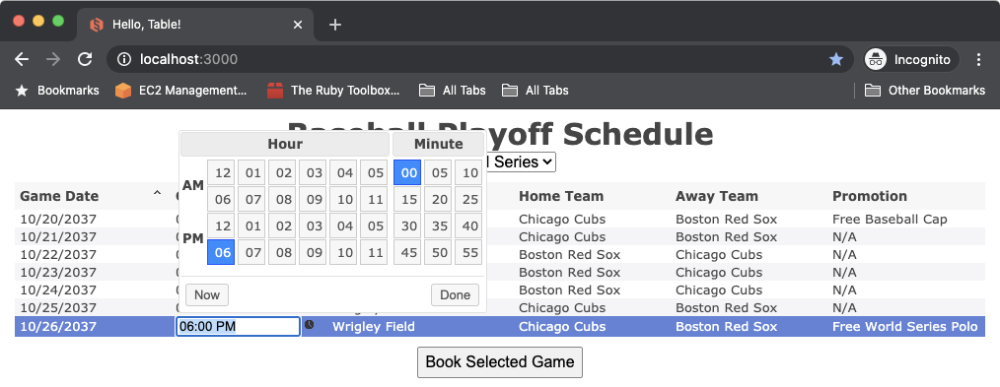

Hello, Table! Editing Home Team

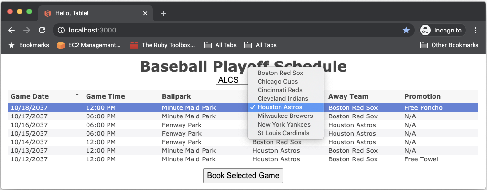

Hello, Table! Sorted Game Date Ascending

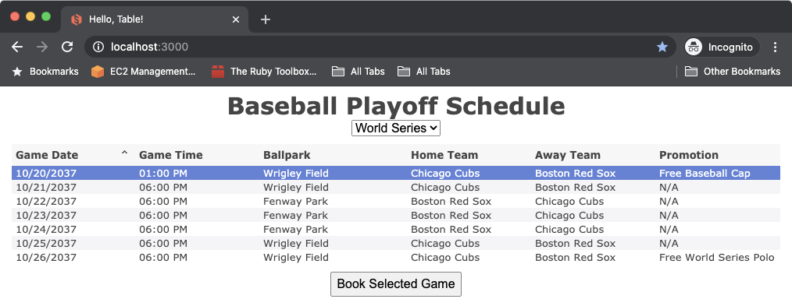

Hello, Table! Sorted Game Date Descending

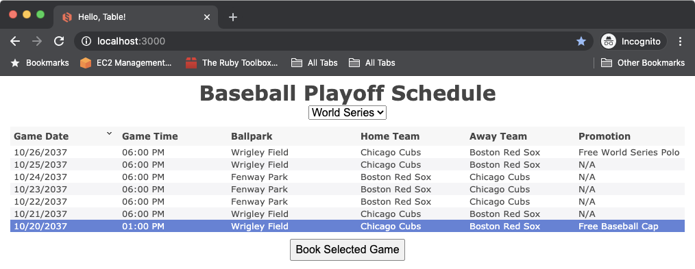

Hello, Table! Playoff Type Combo

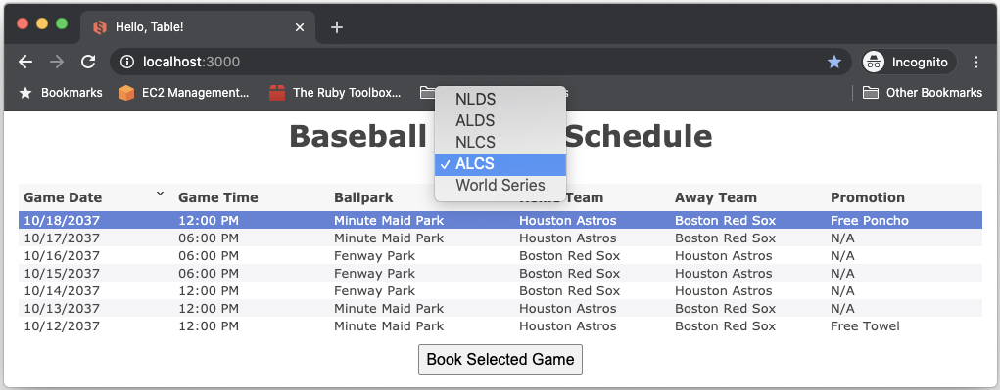

Hello, Table! Playoff Type Changed

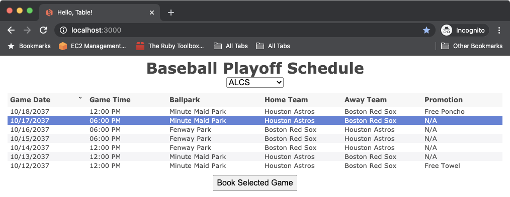

Hello, Table! Game Booked

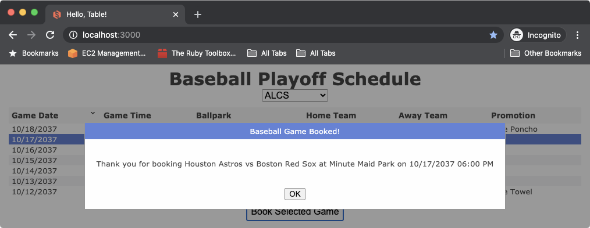

NOTE: Glimmer DSL for Opal is an alpha project. Please help make better by contributing, adopting for small or low risk projects, and providing feedback. It is still an early alpha, so the more feedback and issues you report the better.

**Alpha Version** 0.15.1 only supports bare-minimum capabilities for the included [samples](https://github.com/AndyObtiva/glimmer-dsl-opal#samples) (originally written for [glimmer-dsl-swt](https://github.com/AndyObtiva/glimmer-dsl-swt))

Other [Glimmer](https://github.com/AndyObtiva/glimmer) DSL gems:
- [glimmer-dsl-swt](https://github.com/AndyObtiva/glimmer-dsl-swt): Glimmer DSL for SWT (JRuby Desktop Development GUI Framework)
- [glimmer-dsl-xml](https://github.com/AndyObtiva/glimmer-dsl-xml): Glimmer DSL for XML (& HTML)
- [glimmer-dsl-css](https://github.com/AndyObtiva/glimmer-dsl-css): Glimmer DSL for CSS (Cascading Style Sheets)
- [glimmer-dsl-tk](https://github.com/AndyObtiva/glimmer-dsl-tk): Glimmer DSL for Tk (MRI Ruby Desktop Development GUI Library)

## Table of Contents

- [Glimmer DSL for Opal 0.15.1 (Pure Ruby Web GUI)](#-glimmer-dsl-for-opal-0151-pure-ruby-web-gui)
  - [Principles](#principles)
  - [Background](#background)
  - [Pre-requisites](#pre-requisites)
  - [Setup](#setup)
  - [Supported Glimmer DSL Keywords](#supported-glimmer-dsl-keywords)
  - [Samples](#samples)
    - [Hello Samples](#hello-samples)
      - [Hello, World!](#hello-world)
      - [Hello, Combo!](#hello-combo)
      - [Hello, Computed!](#hello-computed)
      - [Hello, List Single Selection!](#hello-list-single-selection)
      - [Hello, List Multi Selection!](#hello-list-multi-selection)
      - [Hello, Browser!](#hello-browser)
      - [Hello, Tab!](#hello-tab)
      - [Hello, Custom Widget!](#hello-custom-widget)
      - [Hello, Custom Shell!](#hello-custom-shell)
      - [Hello, Radio!](#hello-radio)
      - [Hello, Radio Group!](#hello-radio-group)
      - [Hello, Group!](#hello-group)
      - [Hello, Checkbox!](#hello-checkbox)
      - [Hello, Checkbox Group!](#hello-checkbox-group)
      - [Hello, Date Time!](#hello-date-time)
      - [Hello, Table!](#hello-table)
      - [Hello, Button!](#hello-button)
      - [Hello, Message Box!](#hello-message-box)
      - [Hello, Pop Up Context Menu!](#hello-pop-up-context-menu)
      - [Hello, Menu Bar!](#hello-menu-bar)
      - [Hello, Dialog!](#hello-dialog)
    - [Elaborate Samples](#elaborate-samples)
      - [Login](#login)
      - [Tic Tac Toe](#tic-tac-toe)
      - [Contact Manager](#contact-manager)
      - [Weather](#weather)
    - [External Samples](#external-samples)
      - [Glimmer Calculator](#glimmer-calculator)
  - [Glimmer Supporting Libraries](#glimmer-supporting-libraries)
  - [Glimmer Process](#glimmer-process)
  - [Help](#help)
    - [Issues](#issues)
    - [Chat](#chat)
  - [Feature Suggestions](#feature-suggestions)
  - [Change Log](#change-log)
  - [Contributing](#contributing)
  - [Contributors](#contributors)
  - [License](#license)

## Principles

Please keep in mind this is a live list of innovative ideas, some of which have not been implemented yet. Watch the project on GitHub to stay up to date with its development.

- **Live purely in Rubyland via the Glimmer GUI DSL**, completely oblivious to web browser technologies, thanks to [Opal](https://opalrb.com/).
- **HTML is for creating documents not interactive applications**. As such, software engineers can avoid it and focus on creating web applications more productively with Glimmer DSL for Opal in pure Ruby instead (just like they do in desktop development) while content creators and web designers can be the ones responsible for creating HTML documents for web content purposes only as HTML was originally intended. That way, Glimmer web GUI is used and embedded in web pages when providing users with applications while the rest of the web pages are maintained by non-engineers as pure HTML. This achieves a correct separation of responsibilities and better productivity and maintainability.
- **Approximate styles by developers via the Glimmer GUI DSL. Perfect styles by designers via pure CSS**. Developers can simply build GUI with approximate styling similar to desktop GUI and mockups without worrying about pixel-perfect aesthetics. Web designers can take styling further with pure CSS since every HTML element auto-generated by Glimmer DSL for Opal has a predictable ID and CSS class. This achieves a proper separation of responsibilities between developers and designers.
- **Web servers are used just like servers in traditional client/server architecture**, meaning they simply provide RMI services to enable centralizing some of the application logic and data in the cloud to make available everywhere and enable data-sharing with others.
- **Forget Routers!** Glimmer DSL for Opal supports auto-routing of custom shells (windows), which are opened as separate tabs in a web browser with automatically generated routes and bookmarkable URLs.

## Background

The original idea behind Glimmer DSL for Opal (which [later evolved](#principles)) was that you start by having a [Glimmer DSL for SWT](https://github.com/AndyObtiva/glimmer-dsl-swt) desktop app that communicates with a Rails API for any web/cloud concerns. The pure Ruby [Glimmer DSL for SWT](https://github.com/AndyObtiva/glimmer-dsl-swt) is very simple, so it is more productive to build GUI in it since it does not go through a server/client request/response cycle and can be iterated on locally with a much shorter feedback cycle. Once the GUI and the rest of the app is built. You simply embed it in a Rails app as a one line require statement, and BOOM, it just works on the web inside a web browser with the same server/client communication you had in the desktop app (I am working on adding minimal support for net/http in Opal so that desktop apps that use it continue to work in a web browser. Until then, just use [Opal-jQuery](https://github.com/opal/opal-jquery) http support). That way, you get two apps for one: desktop and web.

Part of the idea is that web browsers just render GUI widgets similar to those of a desktop app (after all a web browser is a desktop app), so whether you run your GUI on the desktop or on the web should just be a low-level concern, hopefully automated completely with Glimmer DSL for Opal.

Last but not least, you would likely want some special branding on the web, so you can push that off to a web designer who would be more than happy to do the web graphic design and customize the look and feel with pure CSS (no need for programming with Ruby or JavaScript). This enables a clean separation of concerns and distribution of tasks among developers and designers, let alone saving effort on the web GUI by reusing the desktop GUI as a base right off the bat.

Alternatively, web developers may directly use [Glimmer DSL for Opal](https://rubygems.org/gems/glimmer-dsl-opal) to build the GUI of web apps since it is as simple as desktop development, thus requiring a lot less code that is in pure Ruby only (as demonstrated in examples below) and avoiding opaque web concepts like 'render' and 'reactive' due to treating GUI as persistent just like desktop apps do. No HTML/JS/CSS skills are even required. Still, web designers may be involved with CSS only if needed, thanks to the clean semantic markup [Glimmer DSL for Opal](https://rubygems.org/gems/glimmer-dsl-opal) automatically produces.

## Pre-requisites

- Rails 5: [https://github.com/rails/rails/tree/5-2-stable](https://github.com/rails/rails/tree/5-2-stable)
- Opal 1: [https://github.com/opal/opal-rails](https://github.com/opal/opal-rails)
- jQuery 3: [https://code.jquery.com/](https://code.jquery.com/) (jQuery 3.5.1 is included in the [glimmer-dsl-opal](https://rubygems.org/gems/glimmer-dsl-opal) gem)
- jQuery-UI 1.12: [https://code.jquery.com/](https://jqueryui.com/) (jQuery-UI 1.12.1 is included in the [glimmer-dsl-opal](https://rubygems.org/gems/glimmer-dsl-opal) gem)
- jQuery-UI Timepicker 0.3: [https://code.jquery.com/](https://fgelinas.com/code/timepicker/) (jQuery-UI Timepicker 0.3.3 is included in the [glimmer-dsl-opal](https://rubygems.org/gems/glimmer-dsl-opal) gem)

## Setup

(NOTE: Keep in mind this is a very early experimental and incomplete **alpha**. If you run into issues, try to go back to a [previous revision](https://rubygems.org/gems/glimmer-dsl-opal/versions). Also, there is a slight chance any issues you encounter are fixed in master or some other branch that you could check out instead)

The [glimmer-dsl-opal](https://rubygems.org/gems/glimmer-dsl-opal) gem is a Rails Engine gem that includes assets.

Please follow the following steps to setup.

Install a Rails 5 gem:

```
gem install rails -v5.2.4.4
```

Start a new Rails 5 app:

```
rails new glimmer_app_server
```

Add the following to `Gemfile`:

```
gem 'opal-rails', '~> 1.1.2'
gem 'opal-async', '~> 1.2.0'
gem 'opal-jquery', '~> 0.4.4'
gem 'glimmer-dsl-opal', '~> 0.15.1'
gem 'glimmer-dsl-xml', '~> 1.2.0', require: false
gem 'glimmer-dsl-css', '~> 1.2.0', require: false

```

Follow (opal-rails)[https://github.com/opal/opal-rails] instructions, basically the configuration of: config/initializers/assets.rb

Edit `config/initializers/assets.rb` and add the following at the bottom:
```
Opal.use_gem 'glimmer-dsl-opal'
```

Run:

```
rails g scaffold welcome
```

Modify `config/routes.rb`:

```ruby
root to: 'welcomes#index'
```

Edit `app/views/layouts/application.html.erb` and add the following below other `stylesheet_link_tag` declarations:

```erb
<%= stylesheet_link_tag    'glimmer/glimmer', media: 'all', 'data-turbolinks-track': 'reload' %>
```

Clear the file `app/views/welcomes/index.html.erb` from any content.

Add the following line to the top of an empty `app/assets/javascripts/application.rb` (replacing `application.js`), and add Glimmer GUI DSL code or a require statement for one of the samples below.

```ruby
require 'glimmer-dsl-opal' # brings opal and other dependencies automatically

# require-statement/code goes here.
```

Example to confirm setup is working:

```ruby
require 'glimmer-dsl-opal'

include Glimmer

shell {
  fill_layout
  text 'Example to confirm setup is working'
  label {
    text "Welcome to Glimmer DSL for Opal!"
    foreground :red
    font height: 24
  }
}.open
```

## Supported Glimmer DSL Keywords

The following keywords from [glimmer-dsl-swt](https://github.com/AndyObtiva/glimmer-dsl-swt) have fully functional partial support in Opal:

Widgets:
- `button`: featured in [Hello, Checkbox!](#hello-checkbox) / [Hello, Button!](#hello-button) / [Hello, Table!](#hello-table) / [Hello, Radio Group!](#hello-radio-group) / [Hello, Radio!](#hello-radio) / [Hello, Message Box!](#hello-message-box) / [Hello, List Single Selection!](#hello-list-single-selection) / [Hello, List Multi Selection!](#hello-list-multi-selection) / [Hello, Group!](#hello-group) / [Hello, Combo!](#hello-combo) / [Hello, Checkbox Group!](#hello-checkbox-group) / [Contact Manager](#contact-manager) / [Tic Tac Toe](#tic-tac-toe) / [Login](#login)
- `browser`: featured in [Hello, Browser!](#hello-browser)
- `calendar`: featured in [Hello, Date Time!](#hello-date-time)
- `checkbox`: featured in [Hello, Checkbox Group!](#hello-checkbox-group) / [Hello, Checkbox!](#hello-checkbox)
- `checkbox_group`: featured in [Hello, Checkbox Group!](#hello-checkbox-group)
- `combo`: featured in [Hello, Table!](#hello-table) / [Hello, Combo!](#hello-combo)
- `composite`: featured in [Hello, Radio!](#hello-radio) / [Hello, Computed!](#hello-computed) / [Hello, Checkbox!](#hello-checkbox) / [Tic Tac Toe](#tic-tac-toe) / [Login](#login) / [Contact Manager](#contact-manager)
- `date`: featured in [Hello, Table!](#hello-table) / [Hello, Date Time!](#hello-date-time) / [Hello, Custom Shell!](#hello-custom-shell) / [Tic Tac Toe](#tic-tac-toe)
- `date_drop_down`: featured in [Hello, Table!](#hello-table) / [Hello, Date Time!](#hello-date-time)
- `dialog`: featured in [Hello, Dialog!](#hello-dialog)
- `group`: featured in [Hello, Group!](#hello-group) / [Contact Manager](#contact-manager)
- `label`: featured in [Hello, Computed!](#hello-computed) / [Hello, Checkbox Group!](#hello-checkbox-group) / [Hello, Checkbox!](#hello-checkbox) / [Hello, World!](#hello-world) / [Hello, Table!](#hello-table) / [Hello, Tab!](#hello-tab) / [Hello, Radio Group!](#hello-radio-group) / [Hello, Radio!](#hello-radio) / [Hello, Pop Up Context Menu!](#hello-pop-up-context-menu) / [Hello, Menu Bar!](#hello-menu-bar) / [Hello, Date Time!](#hello-date-time) / [Hello, Custom Widget!](#hello-custom-widget) / [Hello, Custom Shell!](#hello-custom-shell) / [Contact Manager](#contact-manager) / [Login](#login)
- `list` (w/ optional `:multi` SWT style): featured in [Hello, List Single Selection!](#hello-list-single-selection) / [Hello, List Multi Selection!](#hello-list-multi-selection) / [Contact Manager](#contact-manager)
- `menu`: featured in [Hello, Menu Bar!](#hello-menu-bar) / [Hello, Pop Up Context Menu!](#hello-pop-up-context-menu) / [Hello, Table!](#hello-table)
- `menu_bar`: featured in [Hello, Menu Bar!](#hello-menu-bar)
- `menu_item`: featured in [Hello, Table!](#hello-table) / [Hello, Pop Up Context Menu!](#hello-pop-up-context-menu) / [Hello, Menu Bar!](#hello-menu-bar)
- `message_box`: featured in [Hello, Table!](#hello-table) / [Hello, Pop Up Context Menu!](#hello-pop-up-context-menu) / [Hello, Message Box!](#hello-message-box) / [Hello, Menu Bar!](#hello-menu-bar)
- `radio`: featured in [Hello, Radio!](#hello-radio) / [Hello, Group!](#hello-group)
- `radio_group`: featured in [Hello, Radio Group!](#hello-radio-group)
- `scrolled_composite`
- `shell`: featured in [Hello, Checkbox!](#hello-checkbox) / [Hello, Button!](#hello-button) / [Hello, Table!](#hello-table) / [Hello, Tab!](#hello-tab) / [Hello, Radio Group!](#hello-radio-group) / [Hello, Radio!](#hello-radio) / [Hello, List Single Selection!](#hello-list-single-selection) / [Hello, List Multi Selection!](#hello-list-multi-selection) / [Hello, Group!](#hello-group) / [Hello, Date Time!](#hello-date-time) / [Hello, Custom Shell!](#hello-custom-shell) / [Hello, Computed!](#hello-computed) / [Hello, Combo!](#hello-combo) / [Hello, Checkbox Group!](#hello-checkbox-group) / [Contact Manager](#contact-manager) / [Tic Tac Toe](#tic-tac-toe) / [Login](#login)
- `tab_folder`: featured in [Hello, Tab!](#hello-tab)
- `tab_item`: featured in [Hello, Tab!](#hello-tab)
- `table`: featured in [Hello, Custom Shell!](#hello-custom-shell) / [Hello, Table!](#hello-table) / [Contact Manager](#contact-manager)
- `table_column`: featured in [Hello, Table!](#hello-table) / [Hello, Custom Shell!](#hello-custom-shell) / [Contact Manager](#contact-manager)
- `text`: featured in [Hello, Computed!](#hello-computed) / [Login](#login) / [Contact Manager](#contact-manager)
- `time`: featured in [Hello, Table!](#hello-table) / [Hello, Date Time!](#hello-date-time)
- Glimmer::UI::CustomWidget: ability to define any keyword as a custom widget - featured in [Hello, Custom Widget!](#hello-custom-widget)
- Glimmer::UI::CustomShell: ability to define any keyword as a custom shell (aka custom window) that opens in a new browser window (tab) automatically unless there is no shell open in the current browser window (tab) - featured in [Hello, Custom Shell!](#hello-custom-shell)

Layouts:
- `grid_layout`: featured in [Hello, Custom Shell!](#hello-custom-shell) / [Hello, Computed!](#hello-computed) / [Hello, Table!](#hello-table) / [Hello, Pop Up Context Menu!](#hello-pop-up-context-menu) / [Hello, Menu Bar!](#hello-menu-bar) / [Hello, List Single Selection!](#hello-list-single-selection) / [Hello, List Multi Selection!](#hello-list-multi-selection) / [Contact Manager](#contact-manager) / [Login](#login) / [Tic Tac Toe](#tic-tac-toe)
- `row_layout`: featured in [Hello, Radio Group!](#hello-radio-group) / [Hello, Radio!](#hello-radio) / [Hello, Group!](#hello-group) / [Hello, Date Time!](#hello-date-time) / [Hello, Combo!](#hello-combo) / [Hello, Checkbox Group!](#hello-checkbox-group) / [Hello, Checkbox!](#hello-checkbox) / [Contact Manager](#contact-manager)
- `fill_layout`: featured in [Hello, Custom Widget!](#hello-custom-widget)
- `layout_data`: featured in [Hello, Table!](#hello-table) / [Hello, Custom Shell!](#hello-custom-shell) / [Hello, Computed!](#hello-computed) / [Tic Tac Toe](#tic-tac-toe) / [Contact Manager](#contact-manager)

Graphics/Style:
- `color`: featured in [Hello, Custom Widget!](#hello-custom-widget) / [Hello, Menu Bar!](#hello-menu-bar)
- `font`: featured in [Hello, Checkbox Group!](#hello-checkbox-group) / [Hello, Checkbox!](#hello-checkbox) / [Hello, Table!](#hello-table) / [Hello, Radio Group!](#hello-radio-group) / [Hello, Radio!](#hello-radio) / [Hello, Pop Up Context Menu!](#hello-pop-up-context-menu) / [Hello, Menu Bar!](#hello-menu-bar) / [Hello, Group!](#hello-group) / [Hello, Date Time!](#hello-date-time) / [Hello, Custom Widget!](#hello-custom-widget) / [Hello, Custom Shell!](#hello-custom-shell) / [Contact Manager](#contact-manager) / [Tic Tac Toe](#tic-tac-toe)
- `Point` class used in setting location on widgets
- `swt` and `SWT` class to set SWT styles on widgets - featured in [Hello, Custom Shell!](#hello-custom-shell) / [Login](#login) / [Contact Manager](#contact-manager)

Data-Binding/Observers:
- `bind`: featured in [Hello, Computed!](#hello-computed) / [Hello, Combo!](#hello-combo) / [Hello, Checkbox Group!](#hello-checkbox-group) / [Hello, Checkbox!](#hello-checkbox) / [Hello, Button!](#hello-button) / [Hello, Table!](#hello-table) / [Hello, Radio Group!](#hello-radio-group) / [Hello, Radio!](#hello-radio) / [Hello, List Single Selection!](#hello-list-single-selection) / [Hello, List Multi Selection!](#hello-list-multi-selection) / [Hello, Group!](#hello-group) / [Hello, Date Time!](#hello-date-time) / [Hello, Custom Widget!](#hello-custom-widget) / [Hello, Custom Shell!](#hello-custom-shell) / [Login](#login) / [Contact Manager](#contact-manager) / [Tic Tac Toe](#tic-tac-toe)
- `observe`: featured in [Hello, Table!](#hello-table) / [Tic Tac Toe](#tic-tac-toe)
- `on_widget_selected`: featured in [Hello, Combo!](#hello-combo) / [Hello, Checkbox Group!](#hello-checkbox-group) / [Hello, Checkbox!](#hello-checkbox) / [Hello, Button!](#hello-button) / [Hello, Table!](#hello-table) / [Hello, Radio Group!](#hello-radio-group) / [Hello, Radio!](#hello-radio) / [Hello, Pop Up Context Menu!](#hello-pop-up-context-menu) / [Hello, Message Box!](#hello-message-box) / [Hello, Menu Bar!](#hello-menu-bar) / [Hello, List Single Selection!](#hello-list-single-selection) / [Hello, List Multi Selection!](#hello-list-multi-selection) / [Hello, Group!](#hello-group) / [Contact Manager](#contact-manager) / [Login](#login) / [Tic Tac Toe](#tic-tac-toe)
- `on_modify_text`
- `on_key_pressed` (and SWT alias `on_swt_keydown`) - featured in [Login](#login) / [Contact Manager](#contact-manager)
- `on_key_released` (and SWT alias `on_swt_keyup`)
- `on_mouse_down` (and SWT alias `on_swt_mousedown`)
- `on_mouse_up` (and SWT alias `on_swt_mouseup`) - featured in [Hello, Custom Shell!](#hello-custom-shell) / [Contact Manager](#contact-manager)

Event loop:
- `display`: featured in [Tic Tac Toe](#tic-tac-toe)
- `async_exec`: featured in [Hello, Custom Widget!](#hello-custom-widget) / [Hello, Custom Shell!](#hello-custom-shell)

## Samples

Follow the instructions below to try out [glimmer-dsl-swt](https://github.com/AndyObtiva/glimmer-dsl-swt) samples webified via [glimmer-dsl-opal](https://rubygems.org/gems/glimmer-dsl-opal)

The [Hello samples](#hello-samples) demonstrate tiny building blocks (widgets) for building full fledged applications.

The [Elaborate samples](#elaborate-samples) demonstrate more advanced sample applications that assemble multiple building blocks.

This external sample app contains all the samples mentioned below configured inside a Rails [Opal](https://opalrb.com/) app with all the pre-requisites ready to go for convenience:

[https://github.com/AndyObtiva/sample-glimmer-dsl-opal-rails-app](https://github.com/AndyObtiva/sample-glimmer-dsl-opal-rails-app)

You may visit a Heroku hosted version at:

https://sample-glimmer-dsl-opal-app.herokuapp.com/

Note: Some of the screenshots might be out of date with updates done to samples in both [glimmer-dsl-swt](https://github.com/AndyObtiva/glimmer-dsl-swt) and [glimmer-dsl-opal](https://github.com/AndyObtiva/glimmer-dsl-opal).

### Hello Samples

#### Hello, World!

Add the following require statement to `app/assets/javascripts/application.rb`

```ruby
require 'glimmer-dsl-opal/samples/hello/hello_world'
```

Or add the Glimmer code directly if you prefer to play around with it:

```ruby
include Glimmer
   
shell {
  text 'Glimmer'
  label {
    text 'Hello, World!'
  }
}.open
```

Glimmer app on the desktop (using [`glimmer-dsl-swt`](https://github.com/AndyObtiva/glimmer-dsl-swt) gem):


Glimmer app on the web (using `glimmer-dsl-opal` gem):

Start the Rails server:
```
rails s
```

Visit `http://localhost:3000`

You should see "Hello, World!"


#### Hello, Combo!

Add the following require statement to `app/assets/javascripts/application.rb`

```ruby
require 'glimmer-dsl-opal/samples/hello/hello_combo'
```

Or add the Glimmer code directly if you prefer to play around with it:

```ruby
class HelloCombo
  class Person
    attr_accessor :country, :country_options
  
    def initialize
      self.country_options = ['', 'Canada', 'US', 'Mexico']
      reset_country!
    end
  
    def reset_country!
      self.country = 'Canada'
    end
  end

  include Glimmer::UI::CustomShell
  
  before_body {
    @person = Person.new
  }
  
  body {
    shell {
      row_layout(:vertical) {
        fill true
      }
      
      text 'Hello, Combo!'
      
      combo(:read_only) {
        selection <=> [@person, :country] # also binds to country_options by convention
      }
      
      button {
        text 'Reset Selection'
        
        on_widget_selected do
          @person.reset_country!
        end
      }
    }
  }
end

HelloCombo.launch
```
Glimmer app on the desktop (using [`glimmer-dsl-swt`](https://github.com/AndyObtiva/glimmer-dsl-swt) gem):


Glimmer app on the web (using `glimmer-dsl-opal` gem):

Start the Rails server:
```
rails s
```

Visit `http://localhost:3000`

You should see "Hello, Combo!"


#### Hello, Computed!

Add the following require statement to `app/assets/javascripts/application.rb`


```ruby
require 'glimmer-dsl-opal/samples/hello/hello_computed'
```

Or add the Glimmer code directly if you prefer to play around with it:

```ruby
class HelloComputed
  class Contact
    attr_accessor :first_name, :last_name, :year_of_birth
  
    def initialize(attribute_map)
      @first_name = attribute_map[:first_name]
      @last_name = attribute_map[:last_name]
      @year_of_birth = attribute_map[:year_of_birth]
    end
  
    def name
      "#{last_name}, #{first_name}"
    end
  
    def age
      Time.now.year - year_of_birth.to_i
    rescue
      0
    end
  end

  include Glimmer::UI::CustomShell

  before_body {
    @contact = Contact.new(
      first_name: 'Barry',
      last_name: 'McKibbin',
      year_of_birth: 1985
    )
  }

  body {
    shell {
      text 'Hello, Computed!'
      
      composite {
        grid_layout {
          num_columns 2
          make_columns_equal_width true
          horizontal_spacing 20
          vertical_spacing 10
        }
        
        label {text 'First &Name: '}
        text {
          text <=> [@contact, :first_name]
          layout_data {
            horizontal_alignment :fill
            grab_excess_horizontal_space true
          }
        }
        
        label {text '&Last Name: '}
        text {
          text <=> [@contact, :last_name]
          layout_data {
            horizontal_alignment :fill
            grab_excess_horizontal_space true
          }
        }
        
        label {text '&Year of Birth: '}
        text {
          text <=> [@contact, :year_of_birth]
          layout_data {
            horizontal_alignment :fill
            grab_excess_horizontal_space true
          }
        }
        
        label {text 'Name: '}
        label {
          text <= [@contact, :name, computed_by: [:first_name, :last_name]]
          layout_data {
            horizontal_alignment :fill
            grab_excess_horizontal_space true
          }
        }
        
        label {text 'Age: '}
        label {
          text <= [@contact, :age, on_write: :to_i, computed_by: [:year_of_birth]]
          layout_data {
            horizontal_alignment :fill
            grab_excess_horizontal_space true
          }
        }
      }
    }
  }
end

HelloComputed.launch
```
Glimmer app on the desktop (using [`glimmer-dsl-swt`](https://github.com/AndyObtiva/glimmer-dsl-swt) gem):


Glimmer app on the web (using `glimmer-dsl-opal` gem):

Start the Rails server:
```
rails s
```

Visit `http://localhost:3000`

You should see "Hello, Computed!"


#### Hello, List Single Selection!

Add the following require statement to `app/assets/javascripts/application.rb`


```ruby
require 'glimmer-dsl-opal/samples/hello/hello_list_single_selection'
```

Glimmer app on the desktop (using [`glimmer-dsl-swt`](https://github.com/AndyObtiva/glimmer-dsl-swt) gem):


Glimmer app on the web (using `glimmer-dsl-opal` gem):

Start the Rails server:
```
rails s
```

Visit `http://localhost:3000`

You should see "Hello, List Single Selection!"


#### Hello, List Multi Selection!

Add the following require statement to `app/assets/javascripts/application.rb`

```ruby
require 'glimmer-dsl-opal/samples/hello/hello_list_multi_selection'
```

Glimmer app on the desktop (using [`glimmer-dsl-swt`](https://github.com/AndyObtiva/glimmer-dsl-swt) gem):


Glimmer app on the web (using `glimmer-dsl-opal` gem):

Start the Rails server:
```
rails s
```

Visit `http://localhost:3000`

You should see "Hello, List Multi Selection!"


#### Hello, Browser!

Add the following require statement to `app/assets/javascripts/application.rb`

```ruby
require 'glimmer-dsl-opal/samples/hello/hello_browser'
```

Glimmer app on the desktop (using [`glimmer-dsl-swt`](https://github.com/AndyObtiva/glimmer-dsl-swt) gem):


Glimmer app on the web (using `glimmer-dsl-opal` gem):

Start the Rails server:
```
rails s
```

Visit `http://localhost:3000`

You should see "Hello, Browser!"


#### Hello, Tab!

Add the following require statement to `app/assets/javascripts/application.rb`

```ruby
require 'glimmer-dsl-opal/samples/hello/hello_tab'
```

Or add the Glimmer code directly if you prefer to play around with it:

```ruby
class HelloTab
  include Glimmer
  def launch
    shell {
      text "Hello, Tab!"
      tab_folder {
        tab_item {
          text "English"
          label {
            text "Hello, World!"
          }
        }
        tab_item {
          text "French"
          label {
            text "Bonjour, Univers!"
          }
        }
      }
    }.open
  end
end

HelloTab.new.launch
```
Glimmer app on the desktop (using [`glimmer-dsl-swt`](https://github.com/AndyObtiva/glimmer-dsl-swt) gem):


Glimmer app on the web (using `glimmer-dsl-opal` gem):

Start the Rails server:
```
rails s
```

Visit `http://localhost:3000`

You should see "Hello, Tab!"


#### Hello, Custom Widget!

Add the following require statement to `app/assets/javascripts/application.rb`

```ruby
require 'glimmer-dsl-opal/samples/hello/hello_custom_widget'
```

Or add the Glimmer code directly if you prefer to play around with it:

```ruby
# This class declares a `greeting_label` custom widget (by convention)
class GreetingLabel
  include Glimmer::UI::CustomWidget
  
  # multiple options without default values
  options :name, :colors
  
  # single option with default value
  option :greeting, default: 'Hello'
  
  # internal attribute (not a custom widget option)
  attr_accessor :color
  
  before_body {
    @font = {height: 24, style: :bold}
    @color = :black
  }
  
  after_body {
    return if colors.nil?
    
    Thread.new { # imported from Glimmer DSL for SWT. In Opal, avoid Threads and sleep to avoid blocking GUI.
      colors.cycle { |color|
        async_exec {
          self.color = color
        }
        sleep(1)
      }
    }
  }
  
  body {
    # pass received swt_style through to label to customize (e.g. :center to center text)
    label(swt_style) {
      text "#{greeting}, #{name}!"
      font @font
      foreground <=> [self, :color]
    }
  }
  
end

# including Glimmer enables the Glimmer DSL syntax, including auto-discovery of the `greeting_label` custom widget
include Glimmer

shell {
  fill_layout :vertical
  
  minimum_size 215, 215
  text 'Hello, Custom Widget!'
  
  # custom widget options are passed in a hash
  greeting_label(name: 'Sean')
  
  # pass :center SWT style followed by custom widget options hash
  greeting_label(:center, name: 'Laura', greeting: 'Aloha') #
  
  greeting_label(:right, name: 'Rick') {
    # you can nest attributes under custom widgets just like any standard widget
    foreground :red
  }
  
  # the colors option cycles between colors for the label foreground every second
  greeting_label(:center, name: 'Mary', greeting: 'Aloha', colors: [:red, :dark_green, :blue])
}.open
```
Glimmer app on the desktop (using [`glimmer-dsl-swt`](https://github.com/AndyObtiva/glimmer-dsl-swt) gem):


Glimmer app on the web (using `glimmer-dsl-opal` gem):

Start the Rails server:
```
rails s
```

Visit `http://localhost:3000`

You should see "Hello, Custom Widget!"


#### Hello, Custom Shell!

This sample demonstrates Glimmer DSL for Opal's ability to open multiple shells (windows) as web browser tabs.

It automatically handles routing so that tab URLs are bookmarkable. Web developers do not have to do any routing configuration manually.

Add the following require statement to `app/assets/javascripts/application.rb`

```ruby
require 'glimmer-dsl-opal/samples/hello/hello_custom_shell'
```

Or add the Glimmer code directly if you prefer to play around with it:

```ruby
require 'date'

# This class declares an `email_shell` custom shell, aka custom window (by convention)
# Used to view an email message
class EmailShell
  include Glimmer::UI::CustomShell
  
  # multiple options without default values
  options :date, :subject, :from, :message
  
  # single option with default value
  option :to, default: '"John Irwin" <john.irwin@example.com>'
  
  before_body {
    @swt_style |= swt(:shell_trim, :modeless)
  }
  
  body {
    # pass received swt_style through to shell to customize it (e.g. :dialog_trim for a blocking shell)
    shell(swt_style) {
      grid_layout(2, false)
      
      text subject

      label {
        text 'Date:'
      }
      label {
        text date
      }

      label {
        text 'From:'
      }
      label {
        text from
      }

      label {
        text 'To:'
      }
      label {
        text to
      }

      label {
        text 'Subject:'
      }
      label {
        text subject
      }

      label {
        layout_data(:fill, :fill, true, true) {
          horizontal_span 2 #TODO implement
          vertical_indent 10
        }
        
        background :white
        text message
      }
    }
  }
  
end

class HelloCustomShell
  # including Glimmer enables the Glimmer DSL syntax, including auto-discovery of the `email_shell` custom widget
  include Glimmer
  
  Email = Struct.new(:date, :subject, :from, :message, keyword_init: true)
  EmailSystem = Struct.new(:emails, keyword_init: true)
  
  def initialize
    @email_system = EmailSystem.new(
      emails: [
        Email.new(date: DateTime.new(2029, 10, 22, 11, 3, 0).strftime('%F %I:%M %p'), subject: '3rd Week Report', from: '"Dianne Tux" <dianne.tux@example.com>', message: "Hello,\n\nI was wondering if you'd like to go over the weekly report sometime this afternoon.\n\nDianne"),
        Email.new(date: DateTime.new(2029, 10, 21, 8, 1, 0).strftime('%F %I:%M %p'), subject: 'Glimmer Upgrade v100.0', from: '"Robert McGabbins" <robert.mcgabbins@example.com>', message: "Team,\n\nWe are upgrading to Glimmer version 100.0.\n\nEveryone pull the latest code!\n\nRegards,\n\nRobert McGabbins"),
        Email.new(date: DateTime.new(2029, 10, 19, 16, 58, 0).strftime('%F %I:%M %p'), subject: 'Christmas Party', from: '"Lisa Ferreira" <lisa.ferreira@example.com>', message: "Merry Christmas,\n\nAll office Christmas Party arrangements have been set\n\nMake sure to bring a Secret Santa gift\n\nBest regards,\n\nLisa Ferreira"),
        Email.new(date: DateTime.new(2029, 10, 16, 9, 43, 0).strftime('%F %I:%M %p'), subject: 'Glimmer Upgrade v99.0', from: '"Robert McGabbins" <robert.mcgabbins@example.com>', message: "Team,\n\nWe are upgrading to Glimmer version 99.0.\n\nEveryone pull the latest code!\n\nRegards,\n\nRobert McGabbins"),
        Email.new(date: DateTime.new(2029, 10, 15, 11, 2, 0).strftime('%F %I:%M %p'), subject: '2nd Week Report', from: '"Dianne Tux" <dianne.tux@example.com>', message: "Hello,\n\nI was wondering if you'd like to go over the weekly report sometime this afternoon.\n\nDianne"),
        Email.new(date: DateTime.new(2029, 10, 2, 10, 34, 0).strftime('%F %I:%M %p'), subject: 'Glimmer Upgrade v98.0', from: '"Robert McGabbins" <robert.mcgabbins@example.com>', message: "Team,\n\nWe are upgrading to Glimmer version 98.0.\n\nEveryone pull the latest code!\n\nRegards,\n\nRobert McGabbins"),
      ]
    )
  end
  
  def launch
    shell {
      grid_layout
      
      text 'Hello, Custom Shell!'
      
      label {
        font height: 24, style: :bold
        text 'Emails:'
      }
      
      label {
        font height: 18
        text 'Click an email to view its message'
      }
      
      table {
        layout_data :fill, :fill, true, true
      
        table_column {
          text 'Date:'
          width 180
        }
        table_column {
          text 'Subject:'
          width 180
        }
        table_column {
          text 'From:'
          width 360
        }
        
        items bind(@email_system, :emails), column_properties(:date, :subject, :from)
        
        on_mouse_up { |event|
          email = event.table_item.get_data
          Thread.new do
            async_exec {
              email_shell(date: email.date, subject: email.subject, from: email.from, message: email.message).open
            }
          end
        }
      }
    }.open
  end
end

HelloCustomShell.new.launch
```
Glimmer app on the desktop (using [`glimmer-dsl-swt`](https://github.com/AndyObtiva/glimmer-dsl-swt) gem):


Glimmer app on the web (using `glimmer-dsl-opal` gem):

Start the Rails server:
```
rails s
```

Visit `http://localhost:3000`

You should see "Hello, Custom Widget!"


#### Hello, Radio!

This is the low level way of using `radio`

Add the following require statement to `app/assets/javascripts/application.rb`

```ruby
require 'glimmer-dsl-opal/samples/hello/hello_radio'
```

Glimmer app on the desktop (using [`glimmer-dsl-swt`](https://github.com/AndyObtiva/glimmer-dsl-swt) gem):


Glimmer app on the web (using `glimmer-dsl-opal` gem):

Start the Rails server:
```
rails s
```

Visit `http://localhost:3000`

You should see "Hello, Radio!"


#### Hello, Radio Group!

`radio_group` is a level higher than `radio` in abstraction. It generates a group of radio widgets based on available options in model `attribute_options` methods.

Add the following require statement to `app/assets/javascripts/application.rb`

```ruby
require 'glimmer-dsl-opal/samples/hello/hello_radio_group'
```

Or add the Glimmer code directly if you prefer to play around with it:

```ruby
class HelloRadioGroup
  class Person
    attr_accessor :gender, :age_group
    
    def initialize
      reset!
    end
    
    def gender_options
      ['Male', 'Female']
    end
    
    def age_group_options
      ['Child', 'Teen', 'Adult', 'Senior']
    end
    
    def reset!
      self.gender = nil
      self.age_group = 'Adult'
    end
  end

  include Glimmer::UI::CustomShell
  
  before_body {
    @person = Person.new
  }
  
  body {
    shell {
      text 'Hello, Radio Group!'
      row_layout :vertical
      
      label {
        text 'Gender:'
        font style: :bold
      }
      
      radio_group {
        row_layout :horizontal
        selection <=> [@person, :gender]
      }
            
      label {
        text 'Age Group:'
        font style: :bold
      }
      
      radio_group {
        row_layout :horizontal
        selection <=> [@person, :age_group]
      }
      
      button {
        text 'Reset'
        
        on_widget_selected do
          @person.reset!
        end
      }
    }
  }
end

HelloRadioGroup.launch
```
Glimmer app on the desktop (using [`glimmer-dsl-swt`](https://github.com/AndyObtiva/glimmer-dsl-swt) gem):


Glimmer app on the web (using `glimmer-dsl-opal` gem):

Start the Rails server:
```
rails s
```

Visit `http://localhost:3000`

You should see "Hello, Radio Group!"


#### Hello, Group!

Not to be confused with `radio_group` or `checkbox_group`, `group` simply groups arbitrary widgets together and adds a title header above them.

Add the following require statement to `app/assets/javascripts/application.rb`

```ruby
require 'glimmer-dsl-opal/samples/hello/hello_group'
```

Glimmer app on the desktop (using [`glimmer-dsl-swt`](https://github.com/AndyObtiva/glimmer-dsl-swt) gem):


Glimmer app on the web (using `glimmer-dsl-opal` gem):

Start the Rails server:
```
rails s
```

Visit `http://localhost:3000`

You should see "Hello, Group!"


#### Hello, Checkbox!

This is the low level way of using `checkbox`

Add the following require statement to `app/assets/javascripts/application.rb`

```ruby
require 'glimmer-dsl-opal/samples/hello/hello_checkbox'
```

Glimmer app on the desktop (using [`glimmer-dsl-swt`](https://github.com/AndyObtiva/glimmer-dsl-swt) gem):


Glimmer app on the web (using `glimmer-dsl-opal` gem):

Start the Rails server:
```
rails s
```

Visit `http://localhost:3000`

You should see "Hello, Checkbox!"


#### Hello, Checkbox Group!

`checkbox_group` is a level higher than `checkbox` in abstraction. It generates a group of checkbox widgets based on available options in model `attribute_options` methods.

Add the following require statement to `app/assets/javascripts/application.rb`

```ruby
require 'glimmer-dsl-opal/samples/hello/hello_checkbox_group'
```

Or add the Glimmer code directly if you prefer to play around with it:

```ruby
class HelloCheckboxGroup
  class Person
    attr_accessor :activities
    
    def initialize
      reset_activities
    end
    
    def activities_options
      ['Skiing', 'Snowboarding', 'Snowmobiling', 'Snowshoeing']
    end
    
    def reset_activities
      self.activities = ['Snowboarding']
    end
  end
  
  include Glimmer::UI::CustomShell
  
  before_body {
    @person = Person.new
  }
  
  body {
    shell {
      text 'Hello, Checkbox Group!'
      row_layout :vertical
      
      label {
        text 'Check all snow activities you are interested in:'
        font style: :bold
      }
      
      checkbox_group {
        selection <=> [@person, :activities]
      }
    
      button {
        text 'Reset Activities'
        
        on_widget_selected do
          @person.reset_activities
        end
      }
    }
  }
end

HelloCheckboxGroup.launch
```
Glimmer app on the desktop (using [`glimmer-dsl-swt`](https://github.com/AndyObtiva/glimmer-dsl-swt) gem):


Glimmer app on the web (using `glimmer-dsl-opal` gem):

Start the Rails server:
```
rails s
```

Visit `http://localhost:3000`

You should see "Hello, Checkbox Group!"


#### Hello, Date Time!

Add the following require statement to `app/assets/javascripts/application.rb`

```ruby
require 'glimmer-dsl-opal/samples/hello/hello_date_time'
```

Glimmer app on the desktop (using [`glimmer-dsl-swt`](https://github.com/AndyObtiva/glimmer-dsl-swt) gem):


Glimmer app on the web (using `glimmer-dsl-opal` gem):

Start the Rails server:
```
rails s
```

Visit `http://localhost:3000`

You should see "Hello, Date Time!"


#### Hello, Table!

Note: This [Glimmer DSL for SWT](https://github.com/AndyObtiva/glimmer-dsl-swt) sample has near-complete support, but is missing table context menus at the moment.

Add the following require statement to `app/assets/javascripts/application.rb`

```ruby
require 'glimmer-dsl-opal/samples/hello/hello_table'
```

Glimmer app on the desktop (using [`glimmer-dsl-swt`](https://github.com/AndyObtiva/glimmer-dsl-swt) gem):


Hello, Table! Editing Game Date


Hello, Table! Editing Game Time


Hello, Table! Editing Home Team


Hello, Table! Sorted Game Date Ascending


Hello, Table! Sorted Game Date Descending


Hello, Table! Playoff Type Combo


Hello, Table! Playoff Type Changed


Hello, Table! Game Booked


Glimmer app on the web (using `glimmer-dsl-opal` gem):

Start the Rails server:
```
rails s
```

Visit `http://localhost:3000`

You should see "Hello, Date Time!"


Hello, Table! Editing Game Date


Hello, Table! Editing Game Time


Hello, Table! Editing Home Team


Hello, Table! Sorted Game Date Ascending


Hello, Table! Sorted Game Date Descending


Hello, Table! Playoff Type Combo


Hello, Table! Playoff Type Changed


Hello, Table! Game Booked


#### Hello, Button!

Add the following require statement to `app/assets/javascripts/application.rb`

```ruby
require 'glimmer-dsl-opal/samples/hello/hello_button'
```

Or add the Glimmer code directly if you prefer to play around with it:

```ruby
class HelloButton
  include Glimmer::UI::CustomShell
  
  attr_accessor :count
  
  before_body {
    @count = 0
  }
  
  body {
    shell {
      text 'Hello, Button!'
      
      button {
        text <= [self, :count, on_read: ->(value) { "Click To Increment: #{value}  " }]
        
        on_widget_selected {
          self.count += 1
        }
      }
    }
  }
end

HelloButton.launch
```

Glimmer app on the desktop (using [`glimmer-dsl-swt`](https://github.com/AndyObtiva/glimmer-dsl-swt) gem):


Glimmer app on the web (using `glimmer-dsl-opal` gem):

Start the Rails server:
```
rails s
```

Visit `http://localhost:3000`

You should see "Hello, Button!"

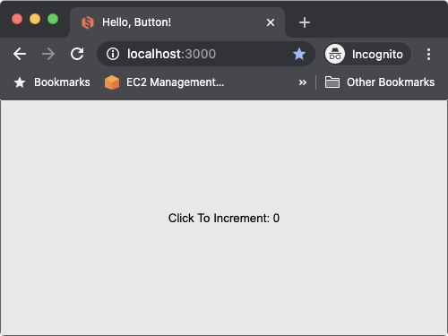
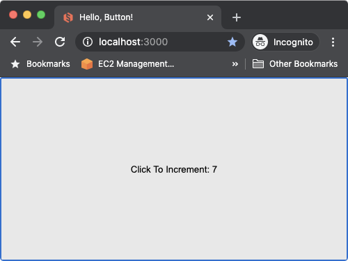

#### Hello, Message Box!

Add the following require statement to `app/assets/javascripts/application.rb`

```ruby
require 'glimmer-dsl-opal/samples/hello/hello_message_box'
```

Or add the Glimmer code directly if you prefer to play around with it:

```ruby
include Glimmer

shell {
  text 'Hello, Message Box!'
  
  button {
    text 'Please Click To Win a Surprise'
    
    on_widget_selected {
      message_box {
        text 'Surprise'
        message "Congratulations!\n\nYou won $1,000,000!"
      }.open
    }
  }
}.open
```

Glimmer app on the desktop (using [`glimmer-dsl-swt`](https://github.com/AndyObtiva/glimmer-dsl-swt) gem):


Glimmer app on the web (using `glimmer-dsl-opal` gem):

Start the Rails server:
```
rails s
```

Visit `http://localhost:3000`

You should see "Hello, Message Box!"

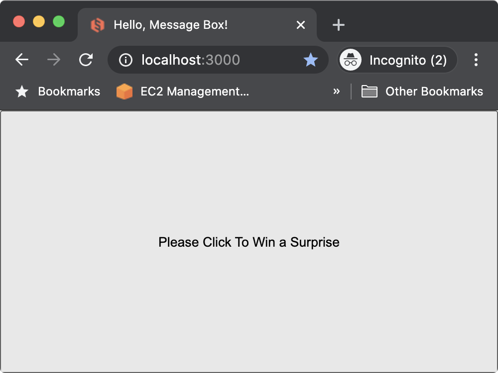
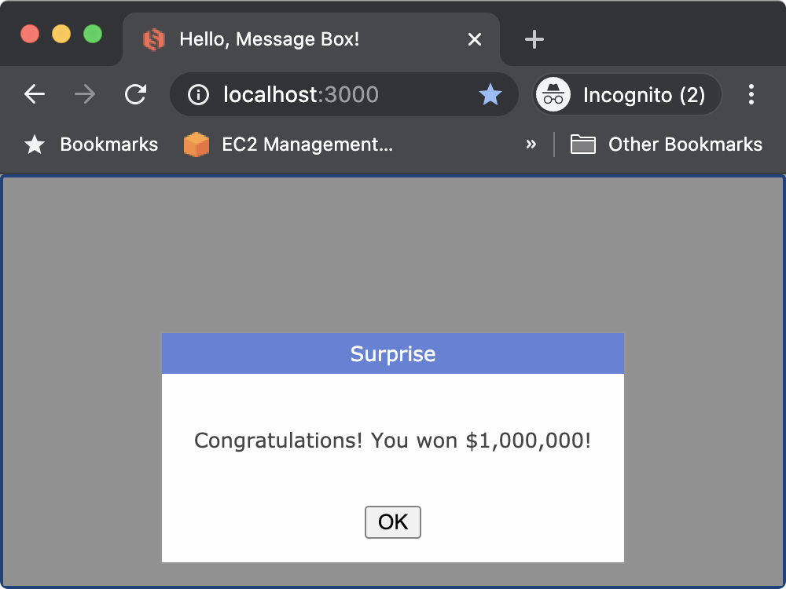

#### Hello, Pop Up Context Menu!

Add the following require statement to `app/assets/javascripts/application.rb`

```ruby
require 'glimmer-dsl-opal/samples/hello/hello_pop_up_context_menu'
```

Or add the Glimmer code directly if you prefer to play around with it:

```ruby
include Glimmer

shell {
  grid_layout {
    margin_width 0
    margin_height 0
  }
  
  text 'Hello, Pop Up Context Menu!'
  
  label {
    text "Right-Click on the Text to\nPop Up a Context Menu"
    font height: 50
    
    menu {
      menu {
        text '&History'
        menu {
          text '&Recent'
          menu_item {
            text 'File 1'
            on_widget_selected {
              message_box {
                text 'File 1'
                message 'File 1 Contents'
              }.open
            }
          }
          menu_item {
            text 'File 2'
            on_widget_selected {
              message_box {
                text 'File 2'
                message 'File 2 Contents'
              }.open
            }
          }
        }
        menu {
          text '&Archived'
          menu_item {
            text 'File 3'
            on_widget_selected {
              message_box {
                text 'File 3'
                message 'File 3 Contents'
              }.open
            }
          }
          menu_item {
            text 'File 4'
            on_widget_selected {
              message_box {
                text 'File 4'
                message 'File 4 Contents'
              }.open
            }
          }
        }
      }
    }
  }
}.open
```

Glimmer app on the desktop (using [`glimmer-dsl-swt`](https://github.com/AndyObtiva/glimmer-dsl-swt) gem):


Glimmer app on the web (using `glimmer-dsl-opal` gem):

Start the Rails server:
```
rails s
```

Visit `http://localhost:3000`

You should see "Hello, Pop Up Context Menu!"

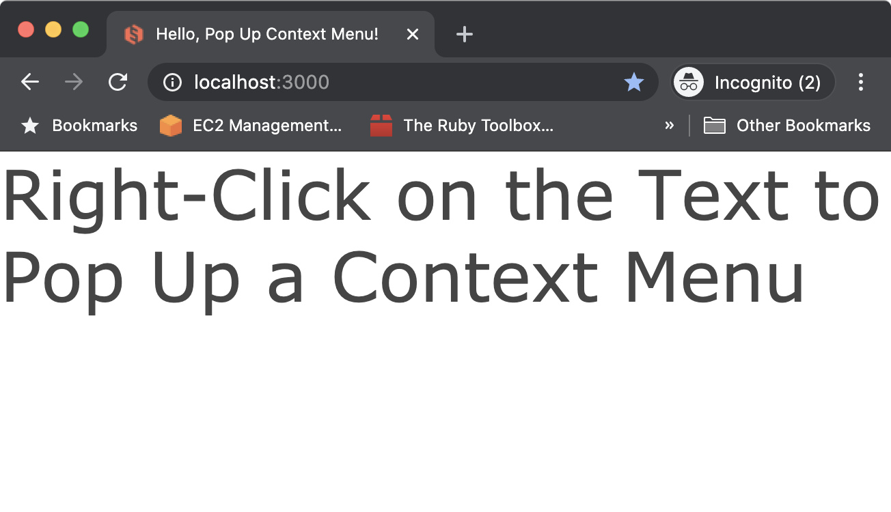
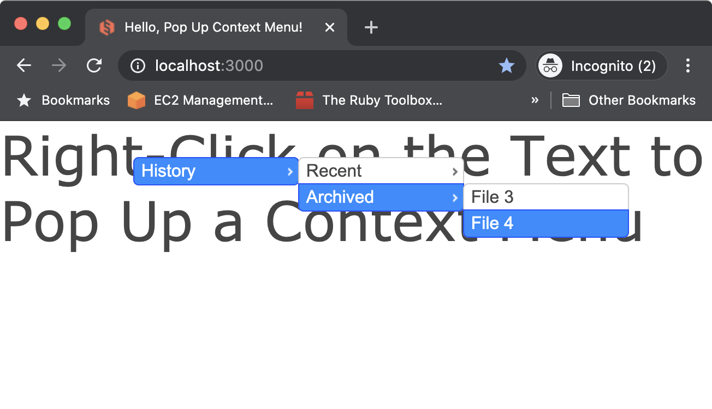

#### Hello, Menu Bar!

This sample demonstrates a menu bar similar to the File menu bar you see at the top of desktop applications.

In web applications, it is typically used to provide website information architecture by denoting things like Products, News, Careers, and About.

In web applications, it is also typically styled by CSS with margin/padding around every menu, distancing it from the top.

When auto-webifying a pre-existing desktop application, the menu bar can be hidden with CSS if not needed, or simply shown on hover only. Web designers could decide these things to their heart's content with pure CSS independently of the developers' code.

Add the following require statement to `app/assets/javascripts/application.rb`

```ruby
require 'glimmer-dsl-opal/samples/hello/hello_menu_bar'
```

Or add the Glimmer code directly if you prefer to play around with it:

```ruby
include Glimmer

COLORS = [:white, :red, :yellow, :green, :blue, :magenta, :gray, :black]

shell {
  grid_layout {
    margin_width 0
    margin_height 0
  }
  
  text 'Hello, Menu Bar!'
  
  @label = label(:center) {
    font height: 50
    text 'Check Out The Menu Bar Above!'
  }
  
  menu_bar {
    menu {
      text '&File'
      menu_item {
        text '&New'
        accelerator :command, :N

        on_widget_selected {
          message_box {
            text 'New'
            message 'New file created.'
          }.open
        }
      }
      menu_item {
        text '&Open...'
        accelerator :command, :O

        on_widget_selected {
          message_box {
            text 'Open'
            message 'Opening File...'
          }.open
        }
      }
      menu {
        text 'Open &Recent'
        menu_item {
          text 'File 1'
          on_widget_selected {
            message_box {
              text 'File 1'
              message 'File 1 Contents'
            }.open
          }
        }
        menu_item {
          text 'File 2'
          on_widget_selected {
            message_box {
              text 'File 2'
              message 'File 2 Contents'
            }.open
          }
        }
      }
      menu_item(:separator)
      menu_item {
        text 'E&xit'

        on_widget_selected {
          exit(0)
        }
      }
    }
    menu {
      text '&Edit'
      menu_item {
        text 'Cut'
        accelerator :command, :X
      }
      menu_item {
        text 'Copy'
        accelerator :command, :C
      }
      menu_item {
        text 'Paste'
        accelerator :command, :V
      }
    }
    menu {
      text '&Options'

      menu_item(:radio) {
        text '&Enabled'

        on_widget_selected {
          @select_one_menu.enabled = true
          @select_multiple_menu.enabled = true
        }
      }
      @select_one_menu = menu {
        text '&Select One'
        enabled false

        menu_item(:radio) {
          text 'Option 1'
        }
        menu_item(:radio) {
          text 'Option 2'
        }
        menu_item(:radio) {
          text 'Option 3'
        }
      }
      @select_multiple_menu = menu {
        text '&Select Multiple'
        enabled false

        menu_item(:check) {
          text 'Option 4'
        }
        menu_item(:check) {
          text 'Option 5'
        }
        menu_item(:check) {
          text 'Option 6'
        }
      }
    }
    menu {
      text '&Format'
      menu {
        text '&Background Color'
        COLORS.each { |color_style|
          menu_item(:radio) {
            text color_style.to_s.split('_').map(&:capitalize).join(' ')

            on_widget_selected {
              @label.background = color_style
            }
          }
        }
      }
      menu {
        text 'Foreground &Color'
        COLORS.each { |color_style|
          menu_item(:radio) {
            text color_style.to_s.split('_').map(&:capitalize).join(' ')

            on_widget_selected {
              @label.foreground = color_style
            }
          }
        }
      }
    }
    menu {
      text '&View'
      menu_item(:radio) {
        text 'Small'

        on_widget_selected {
          @label.font = {height: 25}
          @label.parent.pack
        }
      }
      menu_item(:radio) {
        text 'Medium'
        selection true

        on_widget_selected {
          @label.font = {height: 50}
          @label.parent.pack
        }
      }
      menu_item(:radio) {
        text 'Large'

        on_widget_selected {
          @label.font = {height: 75}
          @label.parent.pack
        }
      }
    }
    menu {
      text '&Help'
      menu_item {
        text '&Manual'
        accelerator :command, :shift, :M

        on_widget_selected {
          message_box {
            text 'Manual'
            message 'Manual Contents'
          }.open
        }
      }
      menu_item {
        text '&Tutorial'
        accelerator :command, :shift, :T

        on_widget_selected {
          message_box {
            text 'Tutorial'
            message 'Tutorial Contents'
          }.open
        }
      }
      menu_item(:separator)
      menu_item {
        text '&Report an Issue...'

        on_widget_selected {
          message_box {
            text 'Report an Issue'
            message 'Reporting an issue...'
          }.open
        }
      }
    }
  }
}.open
```

Glimmer app on the desktop (using [`glimmer-dsl-swt`](https://github.com/AndyObtiva/glimmer-dsl-swt) gem):


Glimmer app on the web (using `glimmer-dsl-opal` gem):

Start the Rails server:
```
rails s
```

Visit `http://localhost:3000`

You should see "Hello, Menu Bar!"

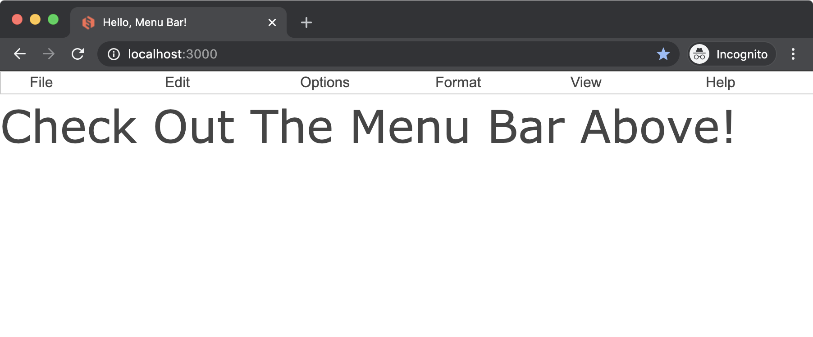


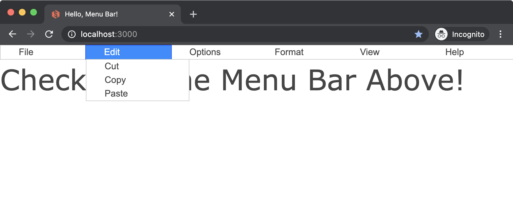

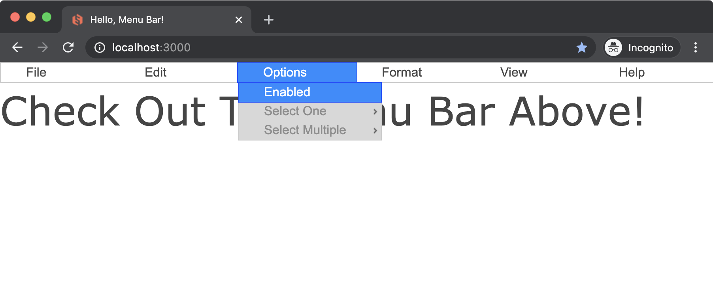

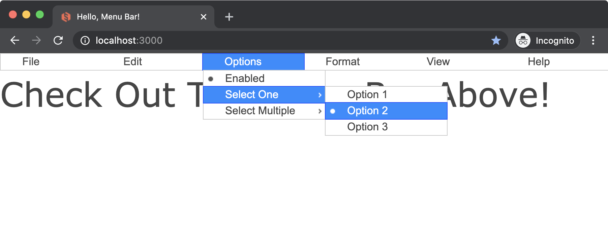

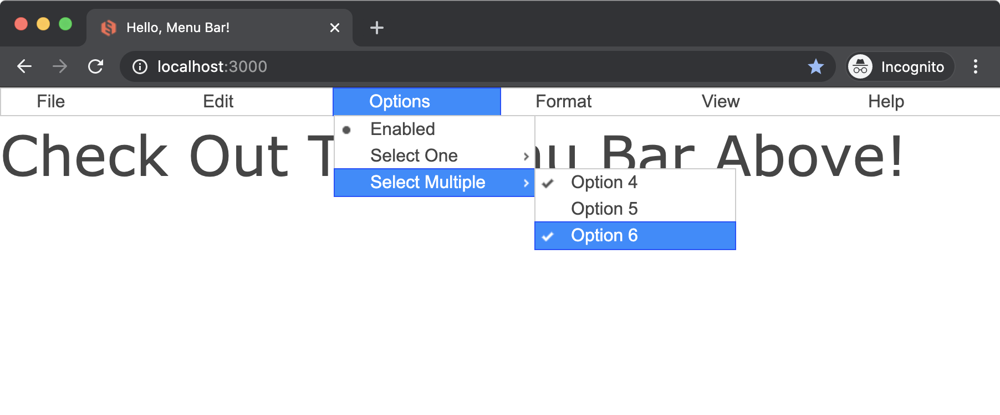

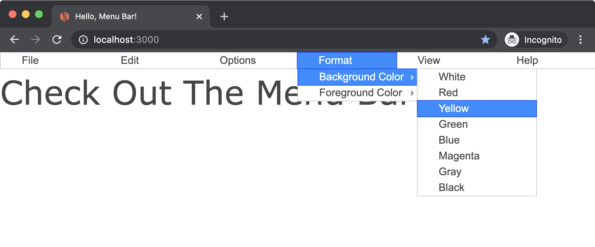

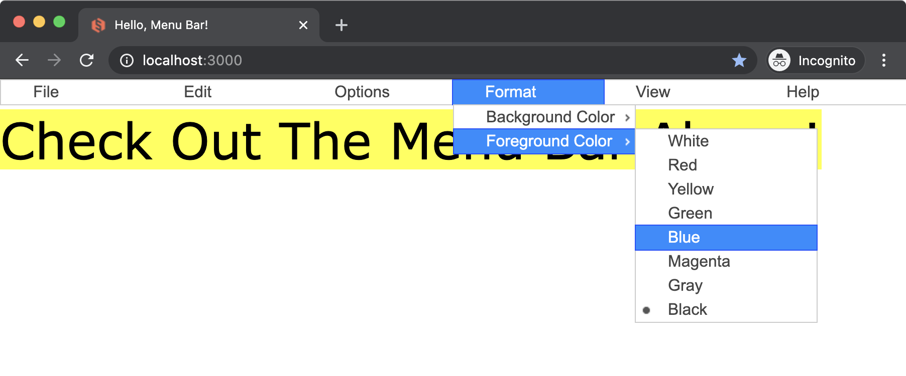

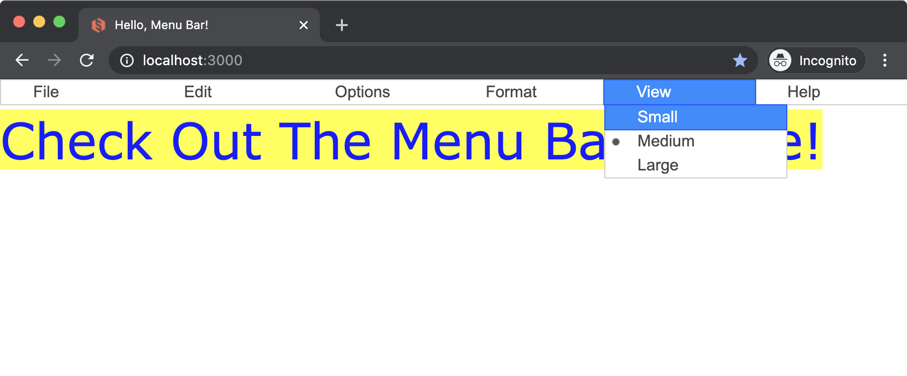

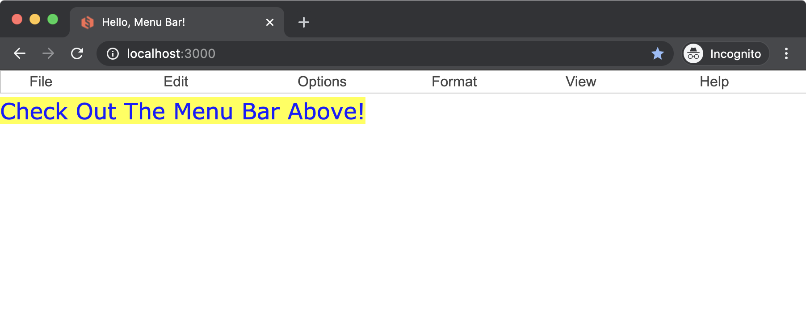

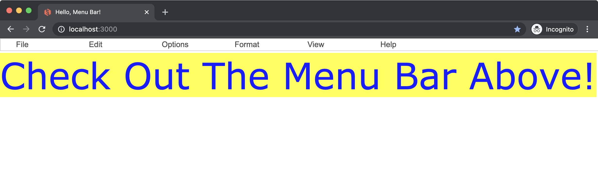

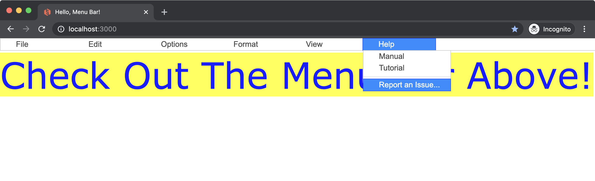

#### Hello, Dialog!

This sample demonstrates a modal dialog similar to message_box, but allows adding arbitrary widgets, not just a message.

Add the following require statement to `app/assets/javascripts/application.rb`

```ruby
require 'glimmer-dsl-opal/samples/hello/hello_dialog'
```

Or add the Glimmer code directly if you prefer to play around with it:

```ruby
include Glimmer

shell {
  row_layout :vertical
  
  text 'Hello, Dialog!'
  
  7.times { |n|
    dialog_number = n + 1
    
    button {
      layout_data {
        width 200
        height 50
      }
      text "Dialog #{dialog_number}"
      
      on_widget_selected {
        dialog { |dialog_proxy|
          row_layout(:vertical) {
            center true
          }
          
          text "Dialog #{dialog_number}"
          
          label {
            text "Given `dialog` is modal, you cannot interact with the main window till the dialog is closed."
          }
          composite {
            row_layout {
              margin_height 0
              margin_top 0
              margin_bottom 0
            }

            label {
              text "Unlike `message_box`, `dialog` can contain arbitrary widgets:"
            }
            radio {
              text 'Radio'
            }
            checkbox {
              text 'Checkbox'
            }
          }
          button {
            text 'Close'
            
            on_widget_selected {
              dialog_proxy.close
            }
          }
        }.open
      }
    }
  }
}.open
```

Glimmer app on the desktop (using [`glimmer-dsl-swt`](https://github.com/AndyObtiva/glimmer-dsl-swt) gem):


Glimmer app on the web (using `glimmer-dsl-opal` gem):

Start the Rails server:
```
rails s
```

Visit `http://localhost:3000`

You should see "Hello, Dialog!"

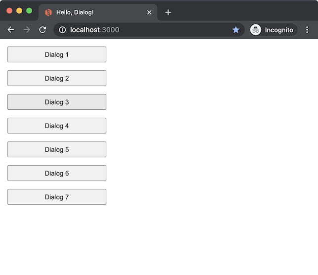

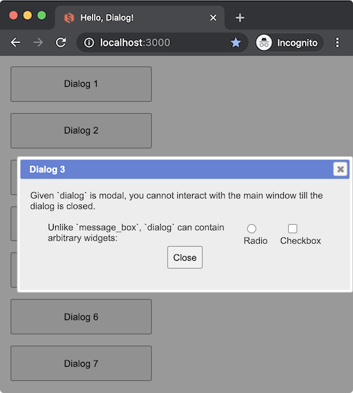

### Elaborate Samples

#### Login

Add the following require statement to `app/assets/javascripts/application.rb`

```ruby
require 'glimmer-dsl-opal/samples/elaborate/login'
```

Or add the Glimmer code directly if you prefer to play around with it:

```ruby
require "observer"

class LoginPresenter

  attr_accessor :user_name
  attr_accessor :password
  attr_accessor :status

  def initialize
    @user_name = ""
    @password = ""
    @status = "Logged Out"
  end

  def status=(status)
    @status = status

    notify_observers("logged_in")
    notify_observers("logged_out")
  end
  
  def valid?
    !@user_name.to_s.strip.empty? && !@password.to_s.strip.empty?
  end

  def logged_in
    self.status == "Logged In"
  end

  def logged_out
    !self.logged_in
  end

  def login
    return unless valid?
    self.status = "Logged In"
  end

  def logout
    self.user_name = ""
    self.password = ""
    self.status = "Logged Out"
  end

end

class Login
  include Glimmer::UI::CustomShell
  
  before_body {
    @presenter = LoginPresenter.new
  }

  body {
    shell {
      text "Login"
      
      composite {
        grid_layout 2, false #two columns with differing widths

        label { text "Username:" } # goes in column 1
        @user_name_text = text {   # goes in column 2
          text <=> [@presenter, :user_name]
          enabled <= [@presenter, :logged_out?, computed_by: :status]
          
          on_key_pressed { |event|
            @password_text.set_focus if event.keyCode == swt(:cr)
          }
        }

        label { text "Password:" }
        @password_text = text(:password, :border) {
          text <=> [@presenter, :password]
          enabled <= [@presenter, :logged_out?, computed_by: :status]
          
          on_key_pressed { |event|
            @presenter.login! if event.keyCode == swt(:cr)
          }
        }

        label { text "Status:" }
        label { text <= [@presenter, :status] }

        button {
          text "Login"
          enabled <= [@presenter, :logged_out?, computed_by: :status]
          
          on_widget_selected { @presenter.login! }
          on_key_pressed { |event|
            if event.keyCode == swt(:cr)
              @presenter.login!
            end
          }
        }

        button {
          text "Logout"
          enabled <= [@presenter, :logged_in?, computed_by: :status]
          
          on_widget_selected { @presenter.logout! }
          on_key_pressed { |event|
            if event.keyCode == swt(:cr)
              @presenter.logout!
              @user_name_text.set_focus
            end
          }
        }
      }
    }
  }
end

Login.launch
```
Glimmer app on the desktop (using [`glimmer-dsl-swt`](https://github.com/AndyObtiva/glimmer-dsl-swt) gem):


Glimmer app on the web (using `glimmer-dsl-opal` gem):

Start the Rails server:
```
rails s
```

Visit `http://localhost:3000`

You should see "Login" dialog


#### Tic Tac Toe

Add the following require statement to `app/assets/javascripts/application.rb`

```ruby
require 'glimmer-dsl-opal/samples/elaborate/tic_tac_toe'
```

```ruby
Glimmer app on the desktop (using [`glimmer-dsl-swt`](https://github.com/AndyObtiva/glimmer-dsl-swt) gem):


Glimmer app on the web (using `glimmer-dsl-opal` gem):

Start the Rails server:
```
rails s
```

Visit `http://localhost:3000`

You should see "Tic Tac Toe"


#### Contact Manager

Add the following require statement to `app/assets/javascripts/application.rb`

```ruby
require 'glimmer-dsl-opal/samples/elaborate/contact_manager'
```

Glimmer app on the desktop (using [`glimmer-dsl-swt`](https://github.com/AndyObtiva/glimmer-dsl-swt) gem):

Glimmer DSL for SWT Contact Manager


Glimmer DSL for SWT Contact Manager Find


Glimmer DSL for SWT Contact Manager Edit Started


Glimmer DSL for SWT Contact Manager Edit In Progress


Glimmer DSL for SWT Contact Manager Edit Done


Glimmer app on the web (using `glimmer-dsl-opal` gem):

Start the Rails server:
```
rails s
```

Visit `http://localhost:3000`

You should see "Tic Tac Toe"

Glimmer DSL for Opal Contact Manager


Glimmer DSL for Opal Contact Manager Find


Glimmer DSL for Opal Contact Manager Edit Started


Glimmer DSL for Opal Contact Manager Edit In Progress


Glimmer DSL for Opal Contact Manager Edit Done


#### Weather

Code: [lib/glimmer-dsl-opal/samples/elaborate/weather](lib/glimmer-dsl-opal/samples/elaborate/weather.rb)

Add the following require statement to `app/assets/javascripts/application.rb`

```ruby
require 'glimmer-dsl-opal/samples/elaborate/weather'
```

Glimmer app on the desktop (using [`glimmer-dsl-swt`](https://github.com/AndyObtiva/glimmer-dsl-swt) gem):


Glimmer app on the web (using `glimmer-dsl-opal` gem):

Start the Rails server:
```
rails s
```

Visit `http://localhost:3000`

You should see "Weather"


### External Samples

#### Glimmer Calculator

Add the [glimmer-cs-calculator](https://github.com/AndyObtiva/glimmer-cs-calculator) gem to `Gemfile` (without requiring):

```
gem 'glimmer-cs-calculator', require: false
```

Add the following require statement to `app/assets/javascripts/application.rb`

```ruby
require 'glimmer-cs-calculator/launch'
```

Glimmer app on the desktop (using the [`glimmer-dsl-swt`](https://github.com/AndyObtiva/glimmer-dsl-swt) gem):


Glimmer app on the web (using `glimmer-dsl-opal` gem):

Start the Rails server:
```
rails s
```

Visit `http://localhost:3000`
(or visit: http://glimmer-cs-calculator-server.herokuapp.com)

You should see "Glimmer Calculator"

[](http://glimmer-cs-calculator-server.herokuapp.com)

Here is an Apple Calculator CSS themed version (with [CSS only](https://github.com/AndyObtiva/glimmer-cs-calculator/blob/master/server/glimmer-cs-calculator-server/app/assets/stylesheets/welcomes_apple.scss), no app code changes):

Visit http://glimmer-cs-calculator-server.herokuapp.com/welcomes/apple

You should see "Apple Calculator Theme"

[](http://glimmer-cs-calculator-server.herokuapp.com/welcomes/apple)

## Glimmer Supporting Libraries

Here is a list of notable 3rd party gems used by Glimmer DSL for Opal:
- [glimmer-dsl-xml](https://github.com/AndyObtiva/glimmer-dsl-xml): Glimmer DSL for XML & HTML in pure Ruby.
- [glimmer-dsl-css](https://github.com/AndyObtiva/glimmer-dsl-css): Glimmer DSL for CSS (Cascading Style Sheets) in pure Ruby.
- [opal-async](https://github.com/AndyObtiva/opal-async): Non-blocking tasks and enumerators for Opal.
- [to_collection](https://github.com/AndyObtiva/to_collection): Treat an array of objects and a singular object uniformly as a collection of objects.

## Glimmer Process

[Glimmer Process](https://github.com/AndyObtiva/glimmer/blob/master/PROCESS.md) is the lightweight software development process used for building Glimmer libraries and Glimmer apps, which goes beyond Agile, rendering all Agile processes obsolete. [Glimmer Process](https://github.com/AndyObtiva/glimmer/blob/master/PROCESS.md) is simply made up of 7 guidelines to pick and choose as necessary until software development needs are satisfied.

Learn more by reading the [GPG](https://github.com/AndyObtiva/glimmer/blob/master/PROCESS.md) (Glimmer Process Guidelines)

## Help

### Issues

You may submit [issues](https://github.com/AndyObtiva/glimmer-dsl-opal/issues) on [GitHub](https://github.com/AndyObtiva/glimmer-dsl-opal/issues).

[Click here to submit an issue.](https://github.com/AndyObtiva/glimmer-dsl-opal/issues)

### Chat

If you need live help, try to [](https://gitter.im/AndyObtiva/glimmer?utm_source=badge&utm_medium=badge&utm_campaign=pr-badge&utm_content=badge)

## Feature Suggestions

These features have been suggested. You might see them in a future version of Glimmer. You are welcome to contribute more feature suggestions.

[TODO.md](TODO.md)

## Change Log

[CHANGELOG.md](CHANGELOG.md)

## Contributing

[CONTRIBUTING.md](CONTRIBUTING.md)

## Contributors

* [Andy Maleh](https://github.com/AndyObtiva) (Founder)

[Click here to view contributor commits.](https://github.com/AndyObtiva/glimmer-dsl-opal/graphs/contributors)

## License

[MIT](https://opensource.org/licenses/MIT)

Copyright (c) 2020-2021 - Andy Maleh.
See [LICENSE.txt](LICENSE.txt) for further details.

--

[](https://github.com/AndyObtiva/glimmer) Built for [Glimmer](https://github.com/AndyObtiva/glimmer) (DSL Framework).
