# [](https://github.com/AndyObtiva/glimmer) Glimmer DSL for Opal 0.7.0 (Pure Ruby Web GUI)
[](http://badge.fury.io/rb/glimmer-dsl-opal)
[](https://gitter.im/AndyObtiva/glimmer?utm_source=badge&utm_medium=badge&utm_campaign=pr-badge&utm_content=badge)

### You can finally live in pure Ruby land on the web!

[Glimmer](https://github.com/AndyObtiva/glimmer) DSL for [Opal](https://opalrb.com/) is an alpha [gem](https://rubygems.org/gems/glimmer-dsl-opal) that enables building web GUI in pure Ruby via [Opal](https://opalrb.com/) on [Rails](https://rubyonrails.org/).

Use in one of two ways:
- **Direct:** build the GUI of web apps with the same friendly desktop GUI Ruby syntax as [Glimmer DSL for SWT](https://github.com/AndyObtiva/glimmer-dsl-swt), thus requiring a lot less code than web technologies that is in pure Ruby and avoiding opaque web concepts like 'render' and 'reactive'. No HTML/JS/CSS skills are even required. Web designers may be involved with CSS styling only if needed.
- **Adapter:** auto-webify [Glimmer](https://github.com/AndyObtiva/glimmer) desktop apps (i.e. apps built with [Glimmer DSL for SWT](https://github.com/AndyObtiva/glimmer-dsl-swt)) via [Opal](https://opalrb.com/) on [Rails](https://rubyonrails.org/) without changing a line of code. Just insert them as a single require statement in a Rails app, and BOOM! They're running on the web! Apps may then optionally be custom-styled for the web by web designers with standard CSS if needed.

Glimmer DSL for Opal successfully reuses the entire [Glimmer](https://github.com/AndyObtiva/glimmer) core DSL engine in [Opal Ruby](https://opalrb.com/) inside a web browser, and as such inherits the full range of powerful Glimmer desktop [data-binding](https://github.com/AndyObtiva/glimmer#data-binding) capabilities for the web.

NOTE: Alpha Version 0.7.0 only supports bare-minimum capabilities for the following [glimmer-dsl-swt](https://github.com/AndyObtiva/glimmer-dsl-swt) [samples](https://github.com/AndyObtiva/glimmer#samples):

Hello:

- [Hello, World!](#hello-world)
- [Hello, Combo!](#hello-combo)
- [Hello, Computed!](#hello-computed)
- [Hello, List Single Selection!](#hello-list-single-selection)
- [Hello, List Multi Selection!](#hello-list-multi-selection)
- [Hello, Browser!](#hello-browser)
- [Hello, Tab!](#hello-tab)
- [Hello, Custom Widget!](#hello-custom-widget)
- [Hello, Custom Shell!](#hello-custom-shell)
- [Hello, Radio!](#hello-radio)
- [Hello, Radio Group!](#hello-radio-group)
- [Hello, Group!](#hello-group)
- [Hello, Checkbox!](#hello-checkbox)
- [Hello, Checkbox Group!](#hello-checkbox-group)
- [Hello, Date Time!](#hello-date-time)
- [Hello, Table!](#hello-table)

Elaborate:

- [Login](#login)
- [Tic Tac Toe](#tic-tac-toe)
- [Contact Manager](#contact-manager)

External:

- [Glimmer Calculator](#glimmer-calculator)

Other [Glimmer](https://github.com/AndyObtiva/glimmer) DSL gems:
- [glimmer-dsl-swt](https://github.com/AndyObtiva/glimmer-dsl-swt): Glimmer DSL for SWT (JRuby Desktop Development GUI Library)
- [glimmer-dsl-tk](https://github.com/AndyObtiva/glimmer-dsl-tk): Glimmer DSL for Tk (Ruby Desktop Development GUI Library)
- [glimmer-dsl-xml](https://github.com/AndyObtiva/glimmer-dsl-xml): Glimmer DSL for XML (& HTML)
- [glimmer-dsl-css](https://github.com/AndyObtiva/glimmer-dsl-css): Glimmer DSL for CSS (Cascading Style Sheets)

## Supported Glimmer DSL Keywords

The following keywords from [glimmer-dsl-swt](https://github.com/AndyObtiva/glimmer-dsl-swt) have partial support in Opal:

Widgets:
- `shell`
- `label`
- `combo`
- `button`
- `text`
- `composite`
- `list` & `list(:multi)`
- `tab_folder`
- `tab_item`
- `table`
- `table_column`
- `message_box`
- Glimmer::UI::CustomWidget: ability to define any keyword as a custom widget
- Glimmer::UI::CustomShell: ability to define any keyword as a custom shell (aka custom window) that opens in a new browser window (tab) automatically unless there is no shell open in the current browser window (tab)

Layouts:
- `grid_layout`
- `row_layout`
- `fill_layout`
- `layout_data`

Graphics:
- `color`
- `font`

Data-Binding/Observers:
- `bind`
- `observe`
- `on_widget_selected`
- `on_modify_text`

Event loop:
- `display`
- `async_exec`

## Background

The original idea behind Glimmer DSL for Opal was that you start by having a [Glimmer DSL for SWT](https://github.com/AndyObtiva/glimmer-dsl-swt) desktop app that communicates with a Rails API for any web/cloud concerns. The pure Ruby [Glimmer DSL for SWT](https://github.com/AndyObtiva/glimmer-dsl-swt) is very simple, so it is more productive to build GUI in it since it does not go through a server/client request/response cycle and can be iterated on locally with a much shorter feedback cycle. Once the GUI and the rest of the app is built. You simply embed it in a Rails app as a one line require statement after adding the Glimmer DSL for Opal gem, and BOOM, it just works on the web inside a web browser with the same server/client communication you had in the desktop app (I am working on adding minimal support for net/http in Opal so that desktop apps that use it continue to work in a web browser. Until then, just use [Opal-jQuery](https://github.com/opal/opal-jquery) http support). That way, you get two apps for one: desktop and web.

Part of the idea is that web browsers just render GUI widgets similar to those of a desktop app (after all a web browser is a desktop app), so whether you run your GUI on the desktop or on the web should just be a low-level concern, hopefully automated completely with Glimmer DSL for Opal.

Last but not least, you would likely want some special branding on the web, so you can push that off to a web designer who would be more than happy to do the web graphic design and customize the look and feel with pure CSS (no need for programming with Ruby or JavaScript). This enables a clean separation of concerns and distribution of tasks among developers and designers, let alone saving effort on the web GUI by reusing the desktop GUI as a base right off the bat.

Alternatively, web developers may directly use [Glimmer DSL for Opal](https://rubygems.org/gems/glimmer-dsl-opal) to build the GUI of web apps since it is as simple as desktop development, thus requiring a lot less code that is in pure Ruby only (as demonstrated in examples below) and avoiding opaque web concepts like 'render' and 'reactive' due to treating GUI as persistent just like desktop apps do. No HTML/JS/CSS skills are even required. Still, web designers may be involved with CSS only if needed, thanks to the clean semantic markup [Glimmer DSL for Opal](https://rubygems.org/gems/glimmer-dsl-opal) automatically produces.

## Pre-requisites

- Rails 5: [https://github.com/rails/rails/tree/5-2-stable](https://github.com/rails/rails/tree/5-2-stable)
- Opal 1: [https://github.com/opal/opal-rails](https://github.com/opal/opal-rails)
- jQuery 3: [https://code.jquery.com/](https://code.jquery.com/) (jQuery 3.5.1 is included in the [glimmer-dsl-opal](https://rubygems.org/gems/glimmer-dsl-opal) gem)
- jQuery-UI 1.12: [https://code.jquery.com/](https://jqueryui.com/) (jQuery-UI 1.12.1 is included in the [glimmer-dsl-opal](https://rubygems.org/gems/glimmer-dsl-opal) gem)
- jQuery-UI Timepicker 0.3: [https://code.jquery.com/](https://fgelinas.com/code/timepicker/) (jQuery-UI Timepicker 0.3.3 is included in the [glimmer-dsl-opal](https://rubygems.org/gems/glimmer-dsl-opal) gem)

## Setup

(NOTE: if you run into issues, keep in mind this is a very early experimental and incomplete alpha. Also, there is a slight chance any issues you encounter are fixed in master or some other branch that you could check out instead)

The [glimmer-dsl-opal](https://rubygems.org/gems/glimmer-dsl-opal) gem is a Rails Engine gem that includes assets.

Please follow the following steps to setup.

Install a Rails 5 gem:

```
gem install rails -v5.2.4.4
```

Start a new Rails 5 app:

```
rails new glimmer_app_server
```

Add the following to `Gemfile`:

```
gem 'opal-rails', '~> 1.1.2'
gem 'opal-async', '~> 1.2.0'
gem 'opal-jquery', '~> 0.4.4'
gem 'glimmer-dsl-opal', '~> 0.7.0'
gem 'glimmer-dsl-xml', '~> 1.1.0', require: false
gem 'glimmer-dsl-css', '~> 1.1.0', require: false

```

Follow (opal-rails)[https://github.com/opal/opal-rails] instructions, basically the configuration of: config/initializers/assets.rb

Edit `config/initializers/assets.rb` and add the following at the bottom:
```
Opal.use_gem 'glimmer-dsl-opal'
```

Run:

```
rails g scaffold welcome
```

Modify `config/routes.rb`:

```ruby
root to: 'welcomes#index'
```

Add the following line to the top of an empty `app/assets/javascripts/application.rb` (replacing `application.js`)

```ruby
require 'glimmer-dsl-opal' # brings opal and other dependencies automatically
```

Edit `app/views/layouts/application.html.erb` and add the following below other `stylesheet_link_tag` declarations:

```erb
<%= stylesheet_link_tag    'glimmer/glimmer', media: 'all', 'data-turbolinks-track': 'reload' %>
```

Open a `Document.ready?` block and add inside it Glimmer GUI DSL code or a require statement for one of the samples below.

```ruby
Document.ready? do
  # require-statement/code goes here.
end
```

Example to confirm setup is working:

```ruby
Document.ready? do
  include Glimmer
  
  shell {
    fill_layout
    text 'Example to confirm setup is working'
    label {
      text "Welcome to Glimmer DSL for Opal!"
      foreground :red
      font height: 24
    }
  }.open
end
```

## Samples

Follow the instructions below to try out [glimmer-dsl-swt](https://github.com/AndyObtiva/glimmer-dsl-swt) samples webified via [glimmer-dsl-opal](https://rubygems.org/gems/glimmer-dsl-opal)

Also, this external sample app contains all the samples mentioned below configured inside a Rails 5 [Opal](https://opalrb.com/) app with all the pre-requisites ready to go for convenience:

[https://github.com/AndyObtiva/sample-glimmer-dsl-opal-rails5-app](https://github.com/AndyObtiva/sample-glimmer-dsl-opal-rails5-app)

Some of the screenshots might be out of date with updates done to samples in both [glimmer-dsl-swt](https://github.com/AndyObtiva/glimmer-dsl-swt) and [glimmer-dsl-opal](https://github.com/AndyObtiva/glimmer-dsl-opal).

### Hello Samples

#### Hello, World!

Add the following require statement to `app/assets/javascripts/application.rb`

```ruby
require 'glimmer-dsl-opal/samples/hello/hello_world'
```

Or add the Glimmer code directly if you prefer to play around with it:

```ruby
include Glimmer
   
shell {
  text 'Glimmer'
  label {
    text 'Hello, World!'
  }
}.open
```

Glimmer app on the desktop (using [`glimmer-dsl-swt`](https://github.com/AndyObtiva/glimmer-dsl-swt) gem):


Glimmer app on the web (using `glimmer-dsl-opal` gem):

Start the Rails server:
```
rails s
```

Visit `http://localhost:3000`

You should see "Hello, World!"


#### Hello, Combo!

Add the following require statement to `app/assets/javascripts/application.rb`

```ruby
require 'glimmer-dsl-opal/samples/hello/hello_combo'
```

Or add the Glimmer code directly if you prefer to play around with it:

```ruby
class Person
  attr_accessor :country, :country_options

  def initialize
    self.country_options = ['', 'Canada', 'US', 'Mexico']
    reset_country
  end

  def reset_country
    self.country = 'Canada'
  end
end

class HelloCombo
  include Glimmer
  
  def launch
    person = Person.new
    
    shell {
      row_layout(:vertical) {
        pack false
      }
      
      text 'Hello, Combo!'
      
      combo(:read_only) {
        selection bind(person, :country)
      }
      
      button {
        text 'Reset Selection'
        
        on_widget_selected do
          person.reset_country
        end
      }
    }.open
  end
end

HelloCombo.new.launch
```
Glimmer app on the desktop (using [`glimmer-dsl-swt`](https://github.com/AndyObtiva/glimmer-dsl-swt) gem):


Glimmer app on the web (using `glimmer-dsl-opal` gem):

Start the Rails server:
```
rails s
```

Visit `http://localhost:3000`

You should see "Hello, Combo!"

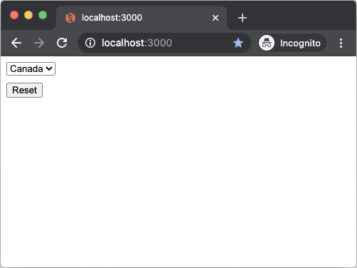

#### Hello, Computed!

Add the following require statement to `app/assets/javascripts/application.rb`


```ruby
require 'glimmer-dsl-opal/samples/hello/hello_computed'
```

Or add the Glimmer code directly if you prefer to play around with it:

```ruby
class HelloComputed
  class Contact
    attr_accessor :first_name, :last_name, :year_of_birth
  
    def initialize(attribute_map)
      @first_name = attribute_map[:first_name]
      @last_name = attribute_map[:last_name]
      @year_of_birth = attribute_map[:year_of_birth]
    end
  
    def name
      "#{last_name}, #{first_name}"
    end
  
    def age
      Time.now.year - year_of_birth.to_i
    rescue
      0
    end
  end
end

class HelloComputed
  include Glimmer

  def initialize
    @contact = Contact.new(
      first_name: 'Barry',
      last_name: 'McKibbin',
      year_of_birth: 1985
    )
  end

  def launch
    shell {
      text 'Hello, Computed!'
      composite {
        grid_layout {
          num_columns 2
          make_columns_equal_width true
          horizontal_spacing 20
          vertical_spacing 10
        }
        label {text 'First &Name: '}
        text {
          text bind(@contact, :first_name)
          layout_data {
            horizontal_alignment :fill
            grab_excess_horizontal_space true
          }
        }
        label {text '&Last Name: '}
        text {
          text bind(@contact, :last_name)
          layout_data {
            horizontal_alignment :fill
            grab_excess_horizontal_space true
          }
        }
        label {text '&Year of Birth: '}
        text {
          text bind(@contact, :year_of_birth)
          layout_data {
            horizontal_alignment :fill
            grab_excess_horizontal_space true
          }
        }
        label {text 'Name: '}
        label {
          text bind(@contact, :name, computed_by: [:first_name, :last_name])
          layout_data {
            horizontal_alignment :fill
            grab_excess_horizontal_space true
          }
        }
        label {text 'Age: '}
        label {
          text bind(@contact, :age, on_write: :to_i, computed_by: [:year_of_birth])
          layout_data {
            horizontal_alignment :fill
            grab_excess_horizontal_space true
          }
        }
      }
    }.open
  end
end

HelloComputed.new.launch
```
Glimmer app on the desktop (using [`glimmer-dsl-swt`](https://github.com/AndyObtiva/glimmer-dsl-swt) gem):


Glimmer app on the web (using `glimmer-dsl-opal` gem):

Start the Rails server:
```
rails s
```

Visit `http://localhost:3000`

You should see "Hello, Computed!"

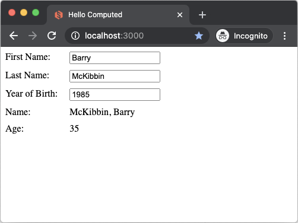

#### Hello, List Single Selection!

Add the following require statement to `app/assets/javascripts/application.rb`


```ruby
require 'glimmer-dsl-opal/samples/hello/hello_list_single_selection'
```

Or add the Glimmer code directly if you prefer to play around with it:

```ruby
class Person
  attr_accessor :country, :country_options

  def initialize
    self.country_options=["", "Canada", "US", "Mexico"]
    self.country = "Canada"
  end

  def reset_country
    self.country = "Canada"
  end
end

class HelloListSingleSelection
  include Glimmer
  def launch
    person = Person.new
    shell {
      composite {
        list {
          selection bind(person, :country)
        }
        button {
          text "Reset"
          on_widget_selected do
            person.reset_country
          end
        }
      }
    }.open
  end
end

HelloListSingleSelection.new.launch
```
Glimmer app on the desktop (using [`glimmer-dsl-swt`](https://github.com/AndyObtiva/glimmer-dsl-swt) gem):


Glimmer app on the web (using `glimmer-dsl-opal` gem):

Start the Rails server:
```
rails s
```

Visit `http://localhost:3000`

You should see "Hello, List Single Selection!"

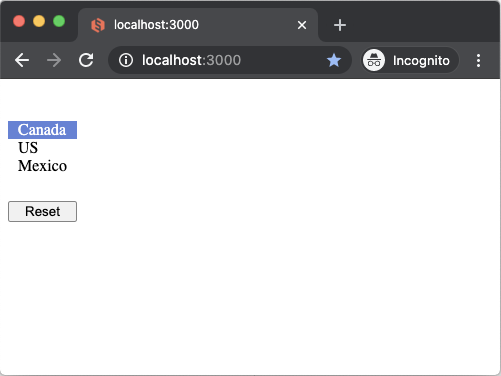

#### Hello, List Multi Selection!

Add the following require statement to `app/assets/javascripts/application.rb`

```ruby
require 'glimmer-dsl-opal/samples/hello/hello_list_multi_selection'
```

Or add the Glimmer code directly if you prefer to play around with it:

```ruby
class Person
  attr_accessor :provinces, :provinces_options

  def initialize
    self.provinces_options=[
      "",
      "Quebec",
      "Ontario",
      "Manitoba",
      "Saskatchewan",
      "Alberta",
      "British Columbia",
      "Nova Skotia",
      "Newfoundland"
    ]
    self.provinces = ["Quebec", "Manitoba", "Alberta"]
  end

  def reset_provinces
    self.provinces = ["Quebec", "Manitoba", "Alberta"]
  end
end

class HelloListMultiSelection
  include Glimmer
  def launch
    person = Person.new
    shell {
      composite {
        list(:multi) {
          selection bind(person, :provinces)
        }
        button {
          text "Reset"
          on_widget_selected do
            person.reset_provinces
          end
        }
      }
    }.open
  end
end

HelloListMultiSelection.new.launch
```
Glimmer app on the desktop (using [`glimmer-dsl-swt`](https://github.com/AndyObtiva/glimmer-dsl-swt) gem):


Glimmer app on the web (using `glimmer-dsl-opal` gem):

Start the Rails server:
```
rails s
```

Visit `http://localhost:3000`

You should see "Hello, List Multi Selection!"

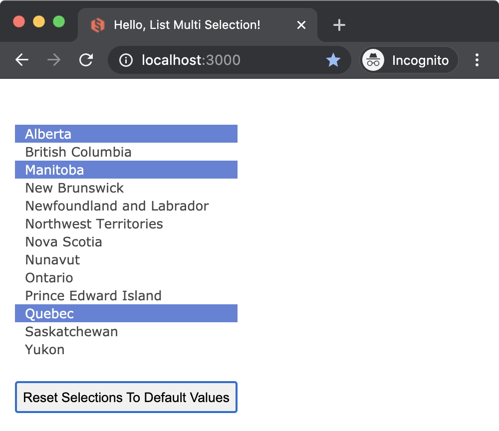

#### Hello, Browser!

Add the following require statement to `app/assets/javascripts/application.rb`

```ruby
require 'glimmer-dsl-opal/samples/hello/hello_browser'
```

Or add the Glimmer code directly if you prefer to play around with it:

```ruby
include Glimmer

shell {
  minimum_size 1024, 860
  browser {
    url 'http://brightonresort.com/about'
  }
}.open
```
Glimmer app on the desktop (using [`glimmer-dsl-swt`](https://github.com/AndyObtiva/glimmer-dsl-swt) gem):


Glimmer app on the web (using `glimmer-dsl-opal` gem):

Start the Rails server:
```
rails s
```

Visit `http://localhost:3000`

You should see "Hello, Browser!"

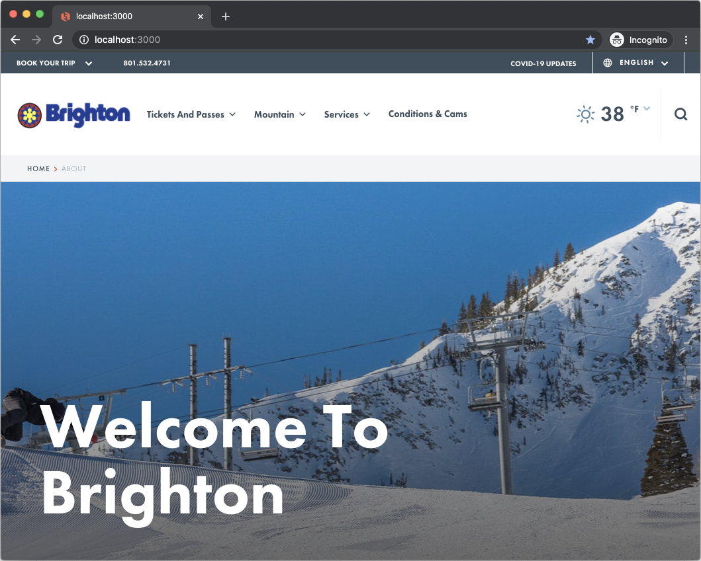

#### Hello, Tab!

Add the following require statement to `app/assets/javascripts/application.rb`

```ruby
require 'glimmer-dsl-opal/samples/hello/hello_tab'
```

Or add the Glimmer code directly if you prefer to play around with it:

```ruby
class HelloTab
  include Glimmer
  def launch
    shell {
      text "Hello, Tab!"
      tab_folder {
        tab_item {
          text "English"
          label {
            text "Hello, World!"
          }
        }
        tab_item {
          text "French"
          label {
            text "Bonjour, Univers!"
          }
        }
      }
    }.open
  end
end

HelloTab.new.launch
```
Glimmer app on the desktop (using [`glimmer-dsl-swt`](https://github.com/AndyObtiva/glimmer-dsl-swt) gem):


Glimmer app on the web (using `glimmer-dsl-opal` gem):

Start the Rails server:
```
rails s
```

Visit `http://localhost:3000`

You should see "Hello, Tab!"

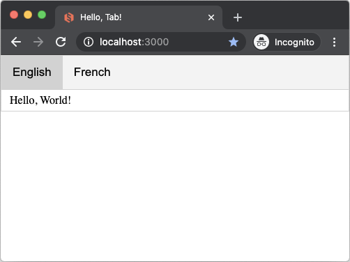


#### Hello, Custom Widget!

Add the following require statement to `app/assets/javascripts/application.rb`

```ruby
require 'glimmer-dsl-opal/samples/hello/hello_custom_widget'
```

Or add the Glimmer code directly if you prefer to play around with it:

```ruby
# This class declares a `greeting_label` custom widget (by convention)
class GreetingLabel
  include Glimmer::UI::CustomWidget
  
  # multiple options without default values
  options :name, :colors
  
  # single option with default value
  option :greeting, default: 'Hello'
  
  # internal attribute (not a custom widget option)
  attr_accessor :color
  
  before_body {
    @font = {height: 24, style: :bold}
    @color = :black
  }
  
  after_body {
    return if colors.nil?
    
    Thread.new {
      colors.cycle { |color|
        async_exec {
          self.color = color
        }
        sleep(1)
      }
    }
  }
  
  body {
    # pass received swt_style through to label to customize (e.g. :center to center text)
    label(swt_style) {
      text "#{greeting}, #{name}!"
      font @font
      foreground bind(self, :color)
    }
  }
  
end

# including Glimmer enables the Glimmer DSL syntax, including auto-discovery of the `greeting_label` custom widget
include Glimmer

shell {
  fill_layout :vertical
  
  minimum_size 215, 215
  text 'Hello, Custom Widget!'
  
  # custom widget options are passed in a hash
  greeting_label(name: 'Sean')
  
  # pass :center SWT style followed by custom widget options hash
  greeting_label(:center, name: 'Laura', greeting: 'Aloha') #
  
  greeting_label(:right, name: 'Rick') {
    # you can nest attributes under custom widgets just like any standard widget
    foreground :red
  }
  
  # the colors option cycles between colors for the label foreground every second
  greeting_label(:center, name: 'Mary', greeting: 'Aloha', colors: [:red, :dark_green, :blue])
}.open
```
Glimmer app on the desktop (using [`glimmer-dsl-swt`](https://github.com/AndyObtiva/glimmer-dsl-swt) gem):


Glimmer app on the web (using `glimmer-dsl-opal` gem):

Start the Rails server:
```
rails s
```

Visit `http://localhost:3000`

You should see "Hello, Custom Widget!"

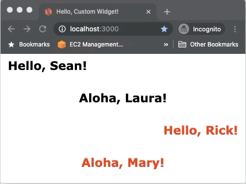

#### Hello, Custom Shell!

Add the following require statement to `app/assets/javascripts/application.rb`

```ruby
require 'glimmer-dsl-opal/samples/hello/hello_custom_shell'
```

Or add the Glimmer code directly if you prefer to play around with it:

```ruby
require 'date'

# This class declares an `email_shell` custom shell, aka custom window (by convention)
# Used to view an email message
class EmailShell
  include Glimmer::UI::CustomShell
  
  # multiple options without default values
  options :date, :subject, :from, :message
  
  # single option with default value
  option :to, default: '"John Irwin" <john.irwin@example.com>'
  
  before_body {
    @swt_style |= swt(:shell_trim, :modeless)
  }
  
  body {
    # pass received swt_style through to shell to customize it (e.g. :dialog_trim for a blocking shell)
    shell(swt_style) {
      grid_layout(2, false)
      
      text subject

      label {
        text 'Date:'
      }
      label {
        text date
      }

      label {
        text 'From:'
      }
      label {
        text from
      }

      label {
        text 'To:'
      }
      label {
        text to
      }

      label {
        text 'Subject:'
      }
      label {
        text subject
      }

      label {
        layout_data(:fill, :fill, true, true) {
          horizontal_span 2 #TODO implement
          vertical_indent 10
        }
        
        background :white
        text message
      }
    }
  }
  
end

class HelloCustomShell
  # including Glimmer enables the Glimmer DSL syntax, including auto-discovery of the `email_shell` custom widget
  include Glimmer
  
  Email = Struct.new(:date, :subject, :from, :message, keyword_init: true)
  EmailSystem = Struct.new(:emails, keyword_init: true)
  
  def initialize
    @email_system = EmailSystem.new(
      emails: [
        Email.new(date: DateTime.new(2029, 10, 22, 11, 3, 0).strftime('%F %I:%M %p'), subject: '3rd Week Report', from: '"Dianne Tux" <dianne.tux@example.com>', message: "Hello,\n\nI was wondering if you'd like to go over the weekly report sometime this afternoon.\n\nDianne"),
        Email.new(date: DateTime.new(2029, 10, 21, 8, 1, 0).strftime('%F %I:%M %p'), subject: 'Glimmer Upgrade v100.0', from: '"Robert McGabbins" <robert.mcgabbins@example.com>', message: "Team,\n\nWe are upgrading to Glimmer version 100.0.\n\nEveryone pull the latest code!\n\nRegards,\n\nRobert McGabbins"),
        Email.new(date: DateTime.new(2029, 10, 19, 16, 58, 0).strftime('%F %I:%M %p'), subject: 'Christmas Party', from: '"Lisa Ferreira" <lisa.ferreira@example.com>', message: "Merry Christmas,\n\nAll office Christmas Party arrangements have been set\n\nMake sure to bring a Secret Santa gift\n\nBest regards,\n\nLisa Ferreira"),
        Email.new(date: DateTime.new(2029, 10, 16, 9, 43, 0).strftime('%F %I:%M %p'), subject: 'Glimmer Upgrade v99.0', from: '"Robert McGabbins" <robert.mcgabbins@example.com>', message: "Team,\n\nWe are upgrading to Glimmer version 99.0.\n\nEveryone pull the latest code!\n\nRegards,\n\nRobert McGabbins"),
        Email.new(date: DateTime.new(2029, 10, 15, 11, 2, 0).strftime('%F %I:%M %p'), subject: '2nd Week Report', from: '"Dianne Tux" <dianne.tux@example.com>', message: "Hello,\n\nI was wondering if you'd like to go over the weekly report sometime this afternoon.\n\nDianne"),
        Email.new(date: DateTime.new(2029, 10, 2, 10, 34, 0).strftime('%F %I:%M %p'), subject: 'Glimmer Upgrade v98.0', from: '"Robert McGabbins" <robert.mcgabbins@example.com>', message: "Team,\n\nWe are upgrading to Glimmer version 98.0.\n\nEveryone pull the latest code!\n\nRegards,\n\nRobert McGabbins"),
      ]
    )
  end
  
  def launch
    shell {
      grid_layout
      
      text 'Hello, Custom Shell!'
      
      label {
        font height: 24, style: :bold
        text 'Emails:'
      }
      
      label {
        font height: 18
        text 'Click an email to view its message'
      }
      
      table {
        layout_data :fill, :fill, true, true
      
        table_column {
          text 'Date:'
          width 180
        }
        table_column {
          text 'Subject:'
          width 180
        }
        table_column {
          text 'From:'
          width 360
        }
        
        items bind(@email_system, :emails), column_properties(:date, :subject, :from)
        
        on_mouse_up { |event|
          email = event.table_item.get_data
          Thread.new do
            async_exec {
              email_shell(date: email.date, subject: email.subject, from: email.from, message: email.message).open
            }
          end
        }
      }
    }.open
  end
end

HelloCustomShell.new.launch
```
Glimmer app on the desktop (using [`glimmer-dsl-swt`](https://github.com/AndyObtiva/glimmer-dsl-swt) gem):


Glimmer app on the web (using `glimmer-dsl-opal` gem):

Start the Rails server:
```
rails s
```

Visit `http://localhost:3000`

You should see "Hello, Custom Widget!"

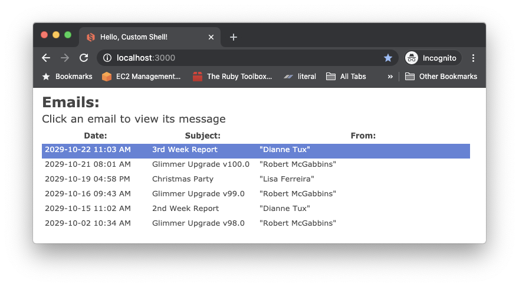
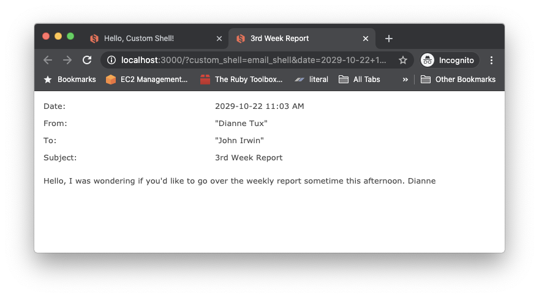
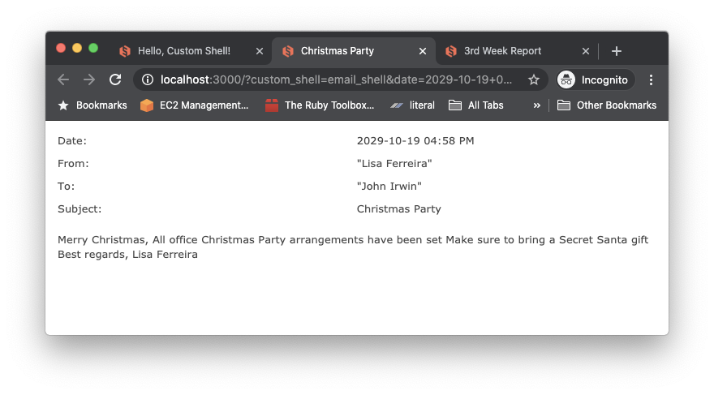
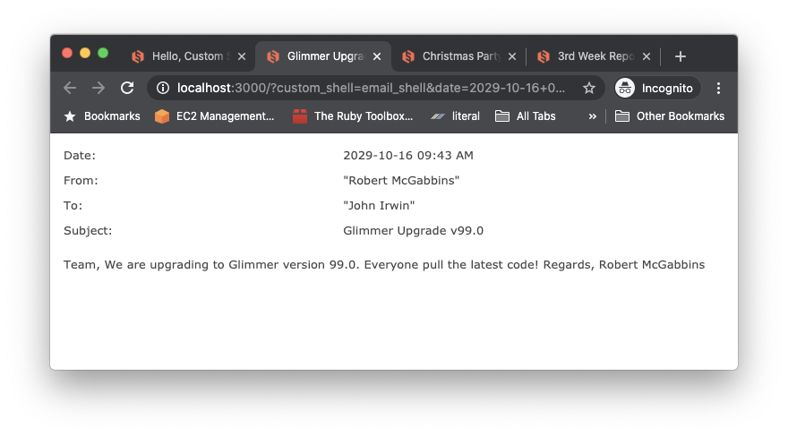

#### Hello, Radio!

Add the following require statement to `app/assets/javascripts/application.rb`

```ruby
require 'glimmer-dsl-opal/samples/hello/hello_radio'
```

Or add the Glimmer code directly if you prefer to play around with it:

```ruby
class HelloRadio
  class Person
    attr_accessor :male, :female, :child, :teen, :adult, :senior
    
    def initialize
      reset
    end
    
    def reset
      self.male = nil
      self.female = nil
      self.child = nil
      self.teen = nil
      self.adult = true
      self.senior = nil
    end
  end
  
  include Glimmer
  
  def launch
    person = Person.new
    
    shell {
      text 'Hello, Radio!'
      row_layout :vertical
      
      label {
        text 'Gender:'
        font style: :bold
      }
      
      composite {
        row_layout
        
        radio {
          text 'Male'
          selection bind(person, :male)
        }
        
        radio {
          text 'Female'
          selection bind(person, :female)
        }
      }
      
      label {
        text 'Age Group:'
        font style: :bold
      }
      
      composite {
        row_layout
        
        radio {
          text 'Child'
          selection bind(person, :child)
        }
        
        radio {
          text 'Teen'
          selection bind(person, :teen)
        }
        
        radio {
          text 'Adult'
          selection bind(person, :adult)
        }
        
        radio {
          text 'Senior'
          selection bind(person, :senior)
        }
      }
      
      button {
        text 'Reset'
        
        on_widget_selected do
          person.reset
        end
      }
    }.open
  end
end

HelloRadio.new.launch
```
Glimmer app on the desktop (using [`glimmer-dsl-swt`](https://github.com/AndyObtiva/glimmer-dsl-swt) gem):


Glimmer app on the web (using `glimmer-dsl-opal` gem):

Start the Rails server:
```
rails s
```

Visit `http://localhost:3000`

You should see "Hello, Radio!"

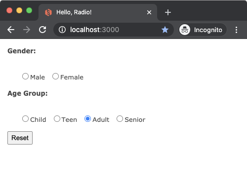

#### Hello, Radio Group!

Add the following require statement to `app/assets/javascripts/application.rb`

```ruby
require 'glimmer-dsl-opal/samples/hello/hello_radio_group'
```

Or add the Glimmer code directly if you prefer to play around with it:

```ruby
class HelloRadioGroup
  class Person
    attr_accessor :gender, :age_group
    
    def initialize
      reset
    end
    
    def gender_options
      ['Male', 'Female']
    end
    
    def age_group_options
      ['Child', 'Teen', 'Adult', 'Senior']
    end
    
    def reset
      self.gender = nil
      self.age_group = 'Adult'
    end
  end

  include Glimmer
  
  def launch
    person = Person.new
    
    shell {
      text 'Hello, Radio Group!'
      row_layout :vertical
      
      label {
        text 'Gender:'
        font style: :bold
      }
      
      radio_group {
        row_layout :horizontal
        selection bind(person, :gender)
      }
            
      label {
        text 'Age Group:'
        font style: :bold
      }
      
      radio_group {
        row_layout :horizontal
        selection bind(person, :age_group)
      }
      
      button {
        text 'Reset'
        
        on_widget_selected do
          person.reset
        end
      }
    }.open
  end
end

HelloRadioGroup.new.launch
```
Glimmer app on the desktop (using [`glimmer-dsl-swt`](https://github.com/AndyObtiva/glimmer-dsl-swt) gem):


Glimmer app on the web (using `glimmer-dsl-opal` gem):

Start the Rails server:
```
rails s
```

Visit `http://localhost:3000`

You should see "Hello, Radio Group!"

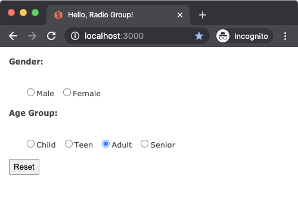

#### Hello, Group!

Add the following require statement to `app/assets/javascripts/application.rb`

```ruby
require 'glimmer-dsl-opal/samples/hello/hello_group'
```

Or add the Glimmer code directly if you prefer to play around with it:

```ruby
class HelloGroup
  class Person
    attr_accessor :male, :female, :child, :teen, :adult, :senior
    
    def initialize
      reset
    end
    
    def reset
      self.male = nil
      self.female = nil
      self.child = nil
      self.teen = nil
      self.adult = true
      self.senior = nil
    end
  end
  
  include Glimmer
  
  def launch
    person = Person.new
    
    shell {
      text 'Hello, Group!'
      row_layout :vertical
      
      group {
        row_layout
        
        text 'Gender'
        font style: :bold
        
        radio {
          text 'Male'
          selection bind(person, :male)
        }
        
        radio {
          text 'Female'
          selection bind(person, :female)
        }
      }
      
      group {
        row_layout
        
        text 'Age Group'
        font style: :bold
        
        radio {
          text 'Child'
          selection bind(person, :child)
        }
        
        radio {
          text 'Teen'
          selection bind(person, :teen)
        }
        
        radio {
          text 'Adult'
          selection bind(person, :adult)
        }
        
        radio {
          text 'Senior'
          selection bind(person, :senior)
        }
      }
      
      button {
        text 'Reset'
        
        on_widget_selected do
          person.reset
        end
      }
    }.open
  end
end

HelloGroup.new.launch
```
Glimmer app on the desktop (using [`glimmer-dsl-swt`](https://github.com/AndyObtiva/glimmer-dsl-swt) gem):


Glimmer app on the web (using `glimmer-dsl-opal` gem):

Start the Rails server:
```
rails s
```

Visit `http://localhost:3000`

You should see "Hello, Group!"

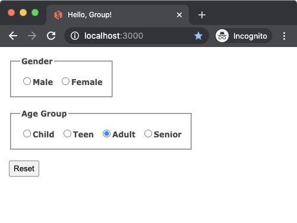

#### Hello, Checkbox!

Add the following require statement to `app/assets/javascripts/application.rb`

```ruby
require 'glimmer-dsl-opal/samples/hello/hello_checkbox'
```

Or add the Glimmer code directly if you prefer to play around with it:

```ruby
class HelloCheckbox
  class Person
    attr_accessor :skiing, :snowboarding, :snowmobiling, :snowshoeing
    
    def initialize
      reset_activities
    end
    
    def reset_activities
      self.skiing = false
      self.snowboarding = true
      self.snowmobiling = false
      self.snowshoeing = false
    end
  end
  
  include Glimmer
  
  def launch
    person = Person.new
    
    shell {
      text 'Hello, Checkbox!'
      row_layout :vertical
      
      label {
        text 'Check all snow activities you are interested in:'
        font style: :bold
      }
      
      composite {
        checkbox {
          text 'Skiing'
          selection bind(person, :skiing)
        }
        
        checkbox {
          text 'Snowboarding'
          selection bind(person, :snowboarding)
        }
        
        checkbox {
          text 'Snowmobiling'
          selection bind(person, :snowmobiling)
        }
        
        checkbox {
          text 'Snowshoeing'
          selection bind(person, :snowshoeing)
        }
      }
      
      button {
        text 'Reset Activities'
        
        on_widget_selected do
          person.reset_activities
        end
      }
    }.open
  end
end

HelloCheckbox.new.launch
```
Glimmer app on the desktop (using [`glimmer-dsl-swt`](https://github.com/AndyObtiva/glimmer-dsl-swt) gem):


Glimmer app on the web (using `glimmer-dsl-opal` gem):

Start the Rails server:
```
rails s
```

Visit `http://localhost:3000`

You should see "Hello, Checkbox!"


#### Hello, Checkbox Group!

Add the following require statement to `app/assets/javascripts/application.rb`

```ruby
require 'glimmer-dsl-opal/samples/hello/hello_checkbox_group'
```

Or add the Glimmer code directly if you prefer to play around with it:

```ruby
class HelloCheckboxGroup
  class Person
    attr_accessor :activities
    
    def initialize
      reset_activities
    end
    
    def activities_options
      ['Skiing', 'Snowboarding', 'Snowmobiling', 'Snowshoeing']
    end
    
    def reset_activities
      self.activities = ['Snowboarding']
    end
  end
  
  include Glimmer
  
  def launch
    person = Person.new
    
    shell {
      text 'Hello, Checkbox Group!'
      row_layout :vertical
      
      label {
        text 'Check all snow activities you are interested in:'
        font style: :bold
      }
      
      checkbox_group {
        selection bind(person, :activities)
      }
    
      button {
        text 'Reset Activities'
        
        on_widget_selected do
          person.reset_activities
        end
      }
    }.open
  end
end

HelloCheckboxGroup.new.launch
```
Glimmer app on the desktop (using [`glimmer-dsl-swt`](https://github.com/AndyObtiva/glimmer-dsl-swt) gem):


Glimmer app on the web (using `glimmer-dsl-opal` gem):

Start the Rails server:
```
rails s
```

Visit `http://localhost:3000`

You should see "Hello, Checkbox Group!"

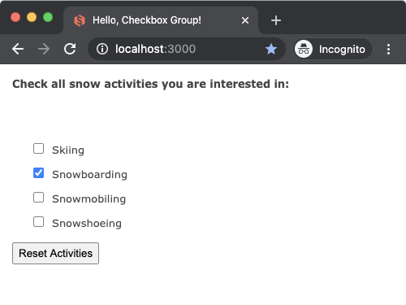

#### Hello, Date Time!

Add the following require statement to `app/assets/javascripts/application.rb`

```ruby
require 'glimmer-dsl-opal/samples/hello/hello_date_time'
```

Or add the Glimmer code directly if you prefer to play around with it:

```ruby
class HelloDateTime
  class Person
    attr_accessor :date_of_birth
  end
  
  include Glimmer
  
  def launch
    person = Person.new
    person.date_of_birth = DateTime.new(2013, 7, 12, 18, 37, 23)
    
    shell {
      row_layout :vertical
      
      text 'Hello, Date Time!'
      minimum_size 180, 180
      
      label {
        text 'Date of Birth'
        font height: 16, style: :bold
      }
      
      date { # alias for date_time(:date)
        date_time bind(person, :date_of_birth)
      }
      
      date_drop_down { # alias for date_time(:date, :drop_down)
        date_time bind(person, :date_of_birth)
      }
      
      time { # alias for date_time(:time)
        date_time bind(person, :date_of_birth)
      }
      
      calendar { # alias for date_time(:calendar)
        date_time bind(person, :date_of_birth)
      }
    }.open
  end
end

HelloDateTime.new.launch
```

Glimmer app on the desktop (using [`glimmer-dsl-swt`](https://github.com/AndyObtiva/glimmer-dsl-swt) gem):


Glimmer app on the web (using `glimmer-dsl-opal` gem):

Start the Rails server:
```
rails s
```

Visit `http://localhost:3000`

You should see "Hello, Date Time!"

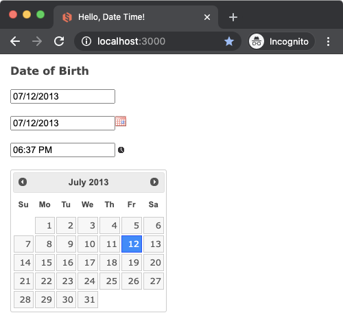

#### Hello, Table!

Note: This [Glimmer DSL for SWT](https://github.com/AndyObtiva/glimmer-dsl-swt) sample has near-complete support, but is missing table context menus and table editing at the moment.

Add the following require statement to `app/assets/javascripts/application.rb`

```ruby
require 'glimmer-dsl-opal/samples/hello/hello_table'
```

Or add the Glimmer code directly if you prefer to play around with it:

```ruby
class HelloTable
  class BaseballGame
    class << self
      attr_accessor :selected_game
      
      def all_playoff_games
        @all_playoff_games ||= {
          'NLDS' => [
            new(Time.new(2037, 10, 6, 12, 0),  'Chicago Cubs', 'Milwaukee Brewers', 'Free Bobblehead'),
            new(Time.new(2037, 10, 7, 12, 0),  'Chicago Cubs', 'Milwaukee Brewers'),
            new(Time.new(2037, 10, 8, 12, 0),  'Milwaukee Brewers', 'Chicago Cubs'),
            new(Time.new(2037, 10, 9, 12, 0),  'Milwaukee Brewers', 'Chicago Cubs'),
            new(Time.new(2037, 10, 10, 12, 0), 'Milwaukee Brewers', 'Chicago Cubs', 'Free Umbrella'),
            new(Time.new(2037, 10, 6, 18, 0),  'Cincinnati Reds', 'St Louis Cardinals', 'Free Bobblehead'),
            new(Time.new(2037, 10, 7, 18, 0),  'Cincinnati Reds', 'St Louis Cardinals'),
            new(Time.new(2037, 10, 8, 18, 0),  'St Louis Cardinals', 'Cincinnati Reds'),
            new(Time.new(2037, 10, 9, 18, 0),  'St Louis Cardinals', 'Cincinnati Reds'),
            new(Time.new(2037, 10, 10, 18, 0), 'St Louis Cardinals', 'Cincinnati Reds', 'Free Umbrella'),
          ],
          'ALDS' => [
            new(Time.new(2037, 10, 6, 12, 0),  'New York Yankees', 'Boston Red Sox', 'Free Bobblehead'),
            new(Time.new(2037, 10, 7, 12, 0),  'New York Yankees', 'Boston Red Sox'),
            new(Time.new(2037, 10, 8, 12, 0),  'Boston Red Sox', 'New York Yankees'),
            new(Time.new(2037, 10, 9, 12, 0),  'Boston Red Sox', 'New York Yankees'),
            new(Time.new(2037, 10, 10, 12, 0), 'Boston Red Sox', 'New York Yankees', 'Free Umbrella'),
            new(Time.new(2037, 10, 6, 18, 0),  'Houston Astros', 'Cleveland Indians', 'Free Bobblehead'),
            new(Time.new(2037, 10, 7, 18, 0),  'Houston Astros', 'Cleveland Indians'),
            new(Time.new(2037, 10, 8, 18, 0),  'Cleveland Indians', 'Houston Astros'),
            new(Time.new(2037, 10, 9, 18, 0),  'Cleveland Indians', 'Houston Astros'),
            new(Time.new(2037, 10, 10, 18, 0), 'Cleveland Indians', 'Houston Astros', 'Free Umbrella'),
          ],
          'NLCS' => [
            new(Time.new(2037, 10, 12, 12, 0), 'Chicago Cubs', 'Cincinnati Reds', 'Free Towel'),
            new(Time.new(2037, 10, 13, 12, 0), 'Chicago Cubs', 'Cincinnati Reds'),
            new(Time.new(2037, 10, 14, 12, 0), 'Cincinnati Reds', 'Chicago Cubs'),
            new(Time.new(2037, 10, 15, 18, 0), 'Cincinnati Reds', 'Chicago Cubs'),
            new(Time.new(2037, 10, 16, 18, 0), 'Cincinnati Reds', 'Chicago Cubs'),
            new(Time.new(2037, 10, 17, 18, 0), 'Chicago Cubs', 'Cincinnati Reds'),
            new(Time.new(2037, 10, 18, 12, 0), 'Chicago Cubs', 'Cincinnati Reds', 'Free Poncho'),
          ],
          'ALCS' => [
            new(Time.new(2037, 10, 12, 12, 0), 'Houston Astros', 'Boston Red Sox', 'Free Towel'),
            new(Time.new(2037, 10, 13, 12, 0), 'Houston Astros', 'Boston Red Sox'),
            new(Time.new(2037, 10, 14, 12, 0), 'Boston Red Sox', 'Houston Astros'),
            new(Time.new(2037, 10, 15, 18, 0), 'Boston Red Sox', 'Houston Astros'),
            new(Time.new(2037, 10, 16, 18, 0), 'Boston Red Sox', 'Houston Astros'),
            new(Time.new(2037, 10, 17, 18, 0), 'Houston Astros', 'Boston Red Sox'),
            new(Time.new(2037, 10, 18, 12, 0), 'Houston Astros', 'Boston Red Sox', 'Free Poncho'),
          ],
          'World Series' => [
            new(Time.new(2037, 10, 20, 18, 0), 'Chicago Cubs', 'Boston Red Sox', 'Free Baseball Cap'),
            new(Time.new(2037, 10, 21, 18, 0), 'Chicago Cubs', 'Boston Red Sox'),
            new(Time.new(2037, 10, 22, 18, 0), 'Boston Red Sox', 'Chicago Cubs'),
            new(Time.new(2037, 10, 23, 18, 0), 'Boston Red Sox', 'Chicago Cubs'),
            new(Time.new(2037, 10, 24, 18, 0), 'Boston Red Sox', 'Chicago Cubs'),
            new(Time.new(2037, 10, 25, 18, 0), 'Chicago Cubs', 'Boston Red Sox'),
            new(Time.new(2037, 10, 26, 18, 0), 'Chicago Cubs', 'Boston Red Sox', 'Free World Series Polo'),
          ]
        }
      end
    
      def playoff_type
        @playoff_type ||= 'World Series'
      end
      
      def playoff_type=(new_playoff_type)
        @playoff_type = new_playoff_type
        self.schedule=(all_playoff_games[@playoff_type])
      end
      
      def playoff_type_options
        all_playoff_games.keys
      end
      
      def schedule
        @schedule ||= all_playoff_games[playoff_type]
      end
      
      def schedule=(new_schedule)
        @schedule = new_schedule
      end
    end
    
    include Glimmer
    include Glimmer::DataBinding::ObservableModel
    
    TEAM_BALLPARKS = {
      'Boston Red Sox'     => 'Fenway Park',
      'Chicago Cubs'       => 'Wrigley Field',
      'Cincinnati Reds'    => 'Great American Ball Park',
      'Cleveland Indians'  => 'Progressive Field',
      'Houston Astros'     => 'Minute Maid Park',
      'Milwaukee Brewers'  => 'Miller Park',
      'New York Yankees'   => 'Yankee Stadium',
      'St Louis Cardinals' => 'Busch Stadium',
    }
    
    attr_accessor :date_time, :home_team, :away_team, :ballpark, :promotion
    
    def initialize(date_time, home_team, away_team, promotion = 'N/A')
      self.date_time = date_time
      self.home_team = home_team
      self.away_team = away_team
      self.promotion = promotion
      observe(self, :date_time) do |new_value|
        notify_observers(:game_date)
        notify_observers(:game_time)
      end
    end
    
    def home_team=(home_team_value)
      if home_team_value != away_team
        @home_team = home_team_value
        self.ballpark = TEAM_BALLPARKS[@home_team]
      end
    end
    
    def away_team=(away_team_value)
      if away_team_value != home_team
        @away_team = away_team_value
      end
    end
    
    def date
      Date.new(date_time.year, date_time.month, date_time.day)
    end
    
    def time
      Time.new(0, 1, 1, date_time.hour, date_time.min, date_time.sec, '+00:00')
    end
    
    def game_date
      date_time.strftime("%m/%d/%Y")
    end
        
    def game_time
      date_time.strftime("%I:%M %p")
    end
        
    def home_team_options
      TEAM_BALLPARKS.keys
    end
    
    def away_team_options
      TEAM_BALLPARKS.keys
    end
    
    def ballpark_options
      [TEAM_BALLPARKS[@home_team], TEAM_BALLPARKS[@away_team]]
    end
    
    def to_s
      "#{home_team} vs #{away_team} at #{ballpark} on #{game_date} #{game_time}"
    end
    
    def book!
      "Thank you for booking #{to_s}"
    end
  end

  include Glimmer
    
  def launch
    shell {
      grid_layout
      
      text 'Hello, Table!'
      
      label {
        layout_data :center, :center, true, false
        
        text 'Baseball Playoff Schedule'
        font height: 30, style: :bold
      }
      
      combo(:read_only) {
        layout_data :center, :center, true, false
        selection bind(BaseballGame, :playoff_type)
        font height: 16
      }
      
      table(:editable) { |table_proxy|
        layout_data :fill, :fill, true, true
      
        table_column {
          text 'Game Date'
          width 150
          sort_property :date # ensure sorting by real date value (not `game_date` string specified in items below)
        }
        table_column {
          text 'Game Time'
          width 150
          sort_property :time # ensure sorting by real time value (not `game_time` string specified in items below)
        }
        table_column {
          text 'Ballpark'
          width 180
        }
        table_column {
          text 'Home Team'
          width 150
        }
        table_column {
          text 'Away Team'
          width 150
        }
        table_column {
          text 'Promotion'
          width 150
          # default text editor is used here
        }
        
        # Data-bind table items (rows) to a model collection property, specifying column properties ordering per nested model
        items bind(BaseballGame, :schedule), column_properties(:game_date, :game_time, :ballpark, :home_team, :away_team, :promotion)
        
        # Data-bind table selection
        selection bind(BaseballGame, :selected_game)
        
        # Default initial sort property
        sort_property :date
        
        # Sort by these additional properties after handling sort by the column the user clicked
        additional_sort_properties :date, :time, :home_team, :away_team, :ballpark, :promotion
      }
      
      button {
        text 'Book Selected Game'
        layout_data :center, :center, true, false
        font height: 16
        enabled bind(BaseballGame, :selected_game)
        
        on_widget_selected {
          book_selected_game
        }
      }
    }.open
  end
  
  def book_selected_game
    message_box {
      text 'Baseball Game Booked!'
      message BaseballGame.selected_game.book!
    }.open
  end
end

HelloTable.new.launch
```

Glimmer app on the desktop (using [`glimmer-dsl-swt`](https://github.com/AndyObtiva/glimmer-dsl-swt) gem):


Glimmer app on the web (using `glimmer-dsl-opal` gem):

Start the Rails server:
```
rails s
```

Visit `http://localhost:3000`

You should see "Hello, Date Time!"

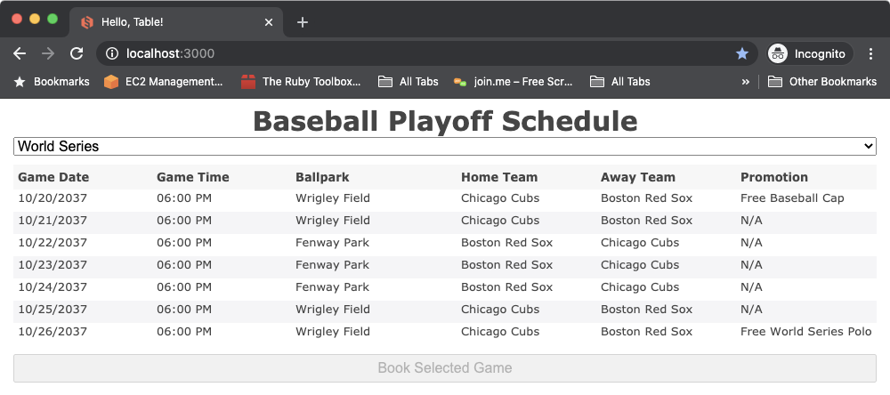

### Elaborate Samples

#### Login

Add the following require statement to `app/assets/javascripts/application.rb`

```ruby
require 'glimmer-dsl-opal/samples/elaborate/login'
```

Or add the Glimmer code directly if you prefer to play around with it:

```ruby
require "observer"

#Presents login screen data
class LoginPresenter

  attr_accessor :user_name
  attr_accessor :password
  attr_accessor :status

  def initialize
    @user_name = ""
    @password = ""
    @status = "Logged Out"
  end

  def status=(status)
    @status = status

    #TODO add feature to bind dependent properties to master property (2017-07-25 nested data binding)
    notify_observers("logged_in")
    notify_observers("logged_out")
  end

  def logged_in
    self.status == "Logged In"
  end

  def logged_out
    !self.logged_in
  end

  def login
    self.status = "Logged In"
  end

  def logout
    self.user_name = ""
    self.password = ""
    self.status = "Logged Out"
  end

end

#Login screen
class Login
  include Glimmer

  def launch
    presenter = LoginPresenter.new
    @shell = shell {
      text "Login"
      composite {
        grid_layout 2, false #two columns with differing widths

        label { text "Username:" } # goes in column 1
        text {                     # goes in column 2
          text bind(presenter, :user_name)
          enabled bind(presenter, :logged_out)
        }

        label { text "Password:" }
        text(:password, :border) {
          text bind(presenter, :password)
          enabled bind(presenter, :logged_out)
        }

        label { text "Status:" }
        label { text bind(presenter, :status) }

        button {
          text "Login"
          enabled bind(presenter, :logged_out)
          on_widget_selected { presenter.login }
        }

        button {
          text "Logout"
          enabled bind(presenter, :logged_in)
          on_widget_selected { presenter.logout }
        }
      }
    }
    @shell.open
  end
end

Login.new.launch
```
Glimmer app on the desktop (using [`glimmer-dsl-swt`](https://github.com/AndyObtiva/glimmer-dsl-swt) gem):


Glimmer app on the web (using `glimmer-dsl-opal` gem):

Start the Rails server:
```
rails s
```

Visit `http://localhost:3000`

You should see "Login" dialog

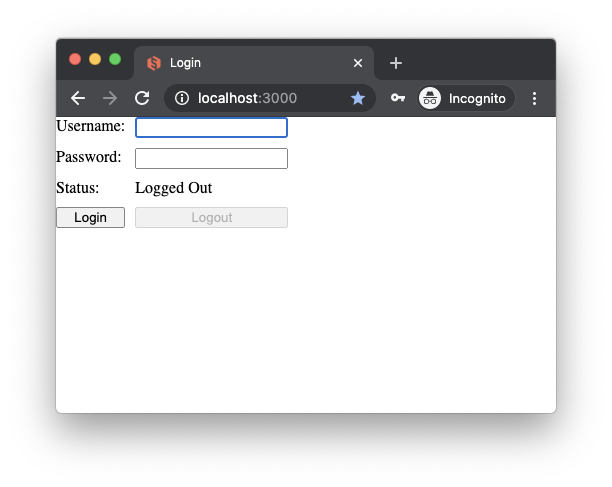
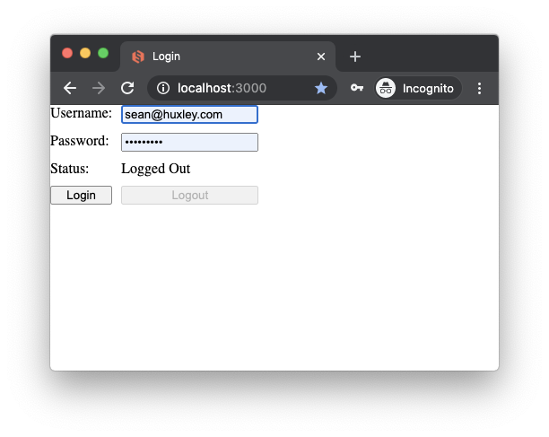


#### Tic Tac Toe

Add the following require statement to `app/assets/javascripts/application.rb`

```ruby
require 'glimmer-dsl-opal/samples/elaborate/tic_tac_toe'
```

Or add the Glimmer code directly if you prefer to play around with it:

```ruby
class TicTacToe
  class Cell
    EMPTY = ""
    attr_accessor :sign, :empty
  
    def initialize
      reset
    end
  
    def mark(sign)
      self.sign = sign
    end
  
    def reset
      self.sign = EMPTY
    end
  
    def sign=(sign_symbol)
      @sign = sign_symbol
      self.empty = sign == EMPTY
    end
  
    def marked
      !empty
    end
  end
end

class TicTacToe
  class Board
    DRAW = :draw
    IN_PROGRESS = :in_progress
    WIN = :win
    attr :winning_sign
    attr_accessor :game_status
  
    def initialize
      @sign_state_machine = {nil => "X", "X" => "O", "O" => "X"}
      build_grid
      @winning_sign = Cell::EMPTY
      @game_status = IN_PROGRESS
    end
  
    #row and column numbers are 1-based
    def mark(row, column)
      self[row, column].mark(current_sign)
      game_over? #updates winning sign
    end
  
    def current_sign
      @current_sign = @sign_state_machine[@current_sign]
    end
  
    def [](row, column)
      @grid[row-1][column-1]
    end
  
    def game_over?
       win? or draw?
    end
  
    def win?
      win = (row_win? or column_win? or diagonal_win?)
      self.game_status=WIN if win
      win
    end
  
    def reset
      (1..3).each do |row|
        (1..3).each do |column|
          self[row, column].reset
        end
      end
      @winning_sign = Cell::EMPTY
      @current_sign = nil
      self.game_status=IN_PROGRESS
    end
  
    private
  
    def build_grid
      @grid = []
      3.times do |row_index| #0-based
        @grid << []
        3.times { @grid[row_index] << Cell.new }
      end
    end
  
    def row_win?
      (1..3).each do |row|
        if row_has_same_sign(row)
          @winning_sign = self[row, 1].sign
          return true
        end
      end
      false
    end
  
    def column_win?
      (1..3).each do |column|
        if column_has_same_sign(column)
          @winning_sign = self[1, column].sign
          return true
        end
      end
      false
    end
  
    #needs refactoring if we ever decide to make the board size dynamic
    def diagonal_win?
      if (self[1, 1].sign == self[2, 2].sign) and (self[2, 2].sign == self[3, 3].sign) and self[1, 1].marked
        @winning_sign = self[1, 1].sign
        return true
      end
      if (self[3, 1].sign == self[2, 2].sign) and (self[2, 2].sign == self[1, 3].sign) and self[3, 1].marked
        @winning_sign = self[3, 1].sign
        return true
      end
      false
    end
  
    def draw?
      @board_full = true
      3.times do |x|
        3.times do |y|
          @board_full = false if self[x, y].empty
        end
      end
      self.game_status = DRAW if @board_full
      @board_full
    end
  
    def row_has_same_sign(number)
      row_sign = self[number, 1].sign
      [2, 3].each do |column|
        return false unless row_sign == (self[number, column].sign)
      end
      true if self[number, 1].marked
    end
  
    def column_has_same_sign(number)
      column_sign = self[1, number].sign
      [2, 3].each do |row|
        return false unless column_sign == (self[row, number].sign)
      end
      true if self[1, number].marked
    end
  
  end
end

class TicTacToe
  include Glimmer

  def initialize
    @tic_tac_toe_board = Board.new
    @shell = shell {
      text "Tic-Tac-Toe"
      minimum_size 150, 178
      composite {
        grid_layout 3, true
        (1..3).each { |row|
          (1..3).each { |column|
            button {
              layout_data :fill, :fill, true, true
              text        bind(@tic_tac_toe_board[row, column], :sign)
              enabled     bind(@tic_tac_toe_board[row, column], :empty)
              font        style: :bold, height: 20
              on_widget_selected {
                @tic_tac_toe_board.mark(row, column)
              }
            }
          }
        }
      }
    }
    observe(@tic_tac_toe_board, :game_status) { |game_status|
      display_win_message if game_status == Board::WIN
      display_draw_message if game_status == Board::DRAW
    }
  end

  def display_win_message
    display_game_over_message("Player #{@tic_tac_toe_board.winning_sign} has won!")
  end

  def display_draw_message
    display_game_over_message("Draw!")
  end

  def display_game_over_message(message_text)
    message_box(@shell) {
      text 'Game Over'
      message message_text
    }.open
    @tic_tac_toe_board.reset
  end

  def open
    @shell.open
  end
end

TicTacToe.new.open
```
Glimmer app on the desktop (using [`glimmer-dsl-swt`](https://github.com/AndyObtiva/glimmer-dsl-swt) gem):


Glimmer app on the web (using `glimmer-dsl-opal` gem):

Start the Rails server:
```
rails s
```

Visit `http://localhost:3000`

You should see "Tic Tac Toe"

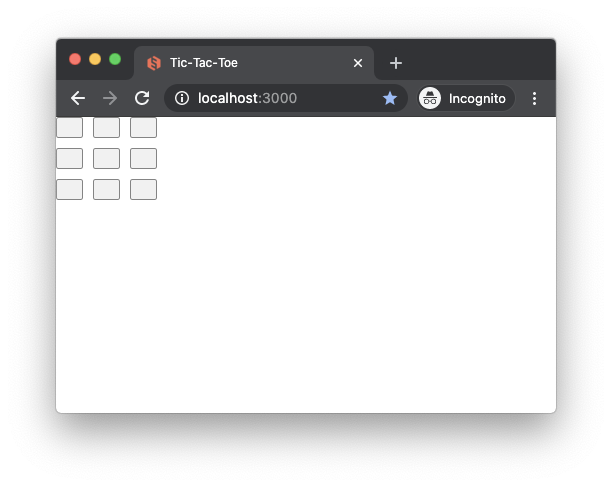
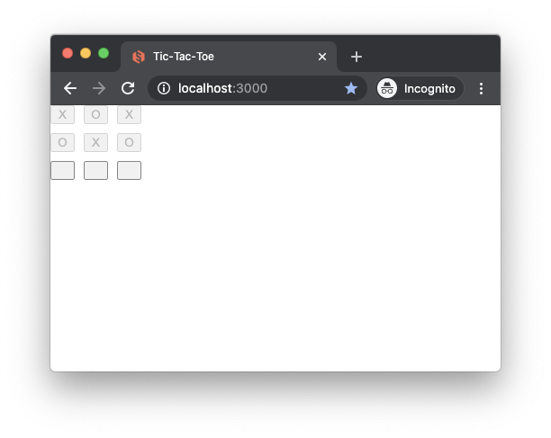
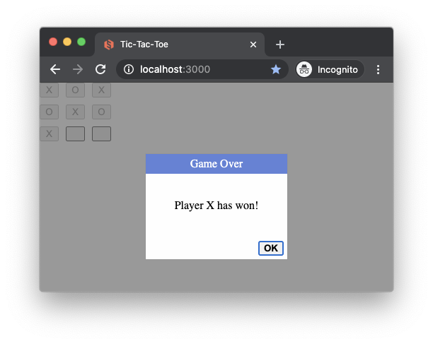

#### Contact Manager

Add the following require statement to `app/assets/javascripts/application.rb`

```ruby
require 'glimmer-dsl-opal/samples/elaborate/contact_manager'
```

Or add the Glimmer code directly if you prefer to play around with it:

```ruby
class ContactManager
  class Contact
    attr_accessor :first_name, :last_name, :email
  
    def initialize(attribute_map)
      @first_name = attribute_map[:first_name]
      @last_name = attribute_map[:last_name]
      @email = attribute_map[:email]
    end
  end
end

class ContactManager
  class ContactRepository
    NAMES_FIRST = %w[
      Liam
      Noah
      William
      James
      Oliver
      Benjamin
      Elijah
      Lucas
      Mason
      Logan
      Alexander
      Ethan
      Jacob
      Michael
      Daniel
      Henry
      Jackson
      Sebastian
      Aiden
      Matthew
      Samuel
      David
      Joseph
      Carter
      Owen
      Wyatt
      John
      Jack
      Luke
      Jayden
      Dylan
      Grayson
      Levi
      Isaac
      Gabriel
      Julian
      Mateo
      Anthony
      Jaxon
      Lincoln
      Joshua
      Christopher
      Andrew
      Theodore
      Caleb
      Ryan
      Asher
      Nathan
      Thomas
      Leo
      Isaiah
      Charles
      Josiah
      Hudson
      Christian
      Hunter
      Connor
      Eli
      Ezra
      Aaron
      Landon
      Adrian
      Jonathan
      Nolan
      Jeremiah
      Easton
      Elias
      Colton
      Cameron
      Carson
      Robert
      Angel
      Maverick
      Nicholas
      Dominic
      Jaxson
      Greyson
      Adam
      Ian
      Austin
      Santiago
      Jordan
      Cooper
      Brayden
      Roman
      Evan
      Ezekiel
      Xaviar
      Jose
      Jace
      Jameson
      Leonardo
      Axel
      Everett
      Kayden
      Miles
      Sawyer
      Jason
      Emma
      Olivia
    ]
    NAMES_LAST = %w[
      Smith
      Johnson
      Williams
      Brown
      Jones
      Miller
      Davis
      Wilson
      Anderson
      Taylor
    ]
    def initialize(contacts = nil)
      @contacts = contacts || 100.times.map do |n|
        random_first_name_index = (rand*NAMES_FIRST.size).to_i
        random_last_name_index = (rand*NAMES_LAST.size).to_i
        first_name = NAMES_FIRST[random_first_name_index]
        last_name = NAMES_LAST[random_last_name_index]
        email = "#{first_name}@#{last_name}.com".downcase
        Contact.new(
          first_name: first_name,
          last_name: last_name,
          email: email
        )
      end
    end
  
    def find(attribute_filter_map)
      @contacts.find_all do |contact|
        match = true
        attribute_filter_map.keys.each do |attribute_name|
          contact_value = contact.send(attribute_name).downcase
          filter_value = attribute_filter_map[attribute_name].downcase
          match = false unless contact_value.match(filter_value)
        end
        match
      end
    end
  end
end

class ContactManager
  class ContactManagerPresenter
    attr_accessor :results
    @@contact_attributes = [:first_name, :last_name, :email]
    @@contact_attributes.each {|attribute_name| attr_accessor attribute_name}
  
    def initialize(contact_repository = nil)
      @contact_repository = contact_repository || ContactRepository.new
      @results = []
    end
  
    def list
      self.results = @contact_repository.find({})
    end
  
    def find
      filter_map = {}
      @@contact_attributes.each do |attribute_name|
        filter_map[attribute_name] = self.send(attribute_name) if self.send(attribute_name)
      end
      self.results = @contact_repository.find(filter_map)
      @sort_attribute_name = nil
      @sort_direction_ascending = nil
    end
  
    def toggle_sort(attribute_name)
      @sort_attribute_name = attribute_name
      @sort_direction_ascending = !@sort_direction_ascending
      sorted_results = self.results.sort_by {|contact| contact.send(attribute_name).downcase}
      sorted_results = sorted_results.reverse unless @sort_direction_ascending
      self.results = sorted_results
    end
  end
end

class ContactManager
  include Glimmer

  def initialize
    @contact_manager_presenter = ContactManagerPresenter.new
    @contact_manager_presenter.list
  end

  def launch
    shell {
      text "Contact Manager"
      composite {
        composite {
          grid_layout 2, false
          label {text "First &Name: "}
          text {
            text bind(@contact_manager_presenter, :first_name)
            on_key_pressed {|key_event|
              @contact_manager_presenter.find if key_event.keyCode == Glimmer::SWT::SWTProxy[:cr]
            }
          }
          label {text "&Last Name: "}
          text {
            text bind(@contact_manager_presenter, :last_name)
            on_key_pressed {|key_event|
              @contact_manager_presenter.find if key_event.keyCode == Glimmer::SWT::SWTProxy[:cr]
            }
          }
          label {text "&Email: "}
          text {
            text bind(@contact_manager_presenter, :email)
            on_key_pressed {|key_event|
              @contact_manager_presenter.find if key_event.keyCode == Glimmer::SWT::SWTProxy[:cr]
            }
          }
          composite {
            grid_layout 2, false
            button {
              text "&Find"
              on_widget_selected {
                @contact_manager_presenter.find
              }
            }
            button {
              text "&List All"
              on_widget_selected {
                @contact_manager_presenter.list
              }
            }
          }
        }

        table(:multi) { |table_proxy|
          layout_data {
            horizontal_alignment :fill
            vertical_alignment :fill
            grab_excess_horizontal_space true
            grab_excess_vertical_space true
            height_hint 200
          }
          table_column {
            text "First Name"
            width 80
            on_widget_selected {
              @contact_manager_presenter.toggle_sort(:first_name)
            }
          }
          table_column {
            text "Last Name"
            width 80
            on_widget_selected {
              @contact_manager_presenter.toggle_sort(:last_name)
            }
          }
          table_column {
            text "Email"
            width 200
            on_widget_selected {
              @contact_manager_presenter.toggle_sort(:email)
            }
          }
          items bind(@contact_manager_presenter, :results), column_properties(:first_name, :last_name, :email)
          on_mouse_down { |event|
            table_proxy.edit_table_item(event.table_item, event.column_index)
          }
        }
      }
    }.open
  end
end

ContactManager.new.launch

```
Glimmer app on the desktop (using [`glimmer-dsl-swt`](https://github.com/AndyObtiva/glimmer-dsl-swt) gem):

Glimmer DSL for SWT Contact Manager


Glimmer DSL for SWT Contact Manager Find


Glimmer DSL for SWT Contact Manager Edit Started


Glimmer DSL for SWT Contact Manager Edit In Progress


Glimmer DSL for SWT Contact Manager Edit Done


Glimmer app on the web (using `glimmer-dsl-opal` gem):

Start the Rails server:
```
rails s
```

Visit `http://localhost:3000`

You should see "Tic Tac Toe"

Glimmer DSL for Opal Contact Manager

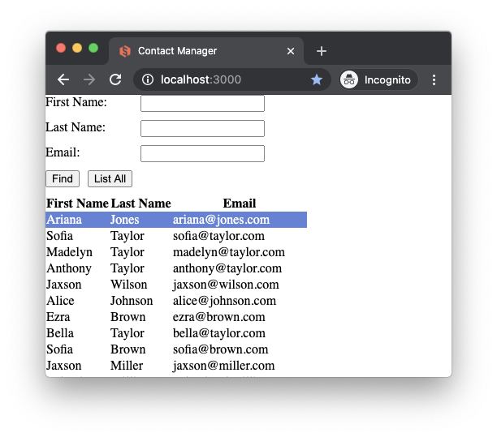

Glimmer DSL for Opal Contact Manager Find

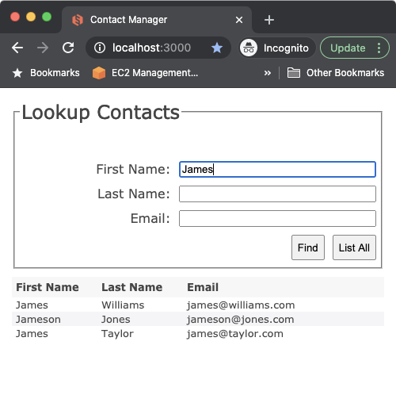

Glimmer DSL for Opal Contact Manager Edit Started

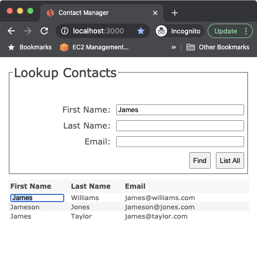

Glimmer DSL for Opal Contact Manager Edit In Progress

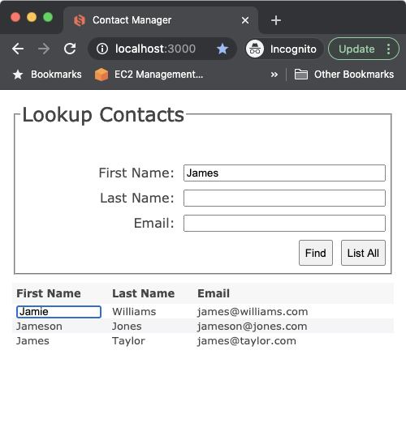

Glimmer DSL for Opal Contact Manager Edit Done

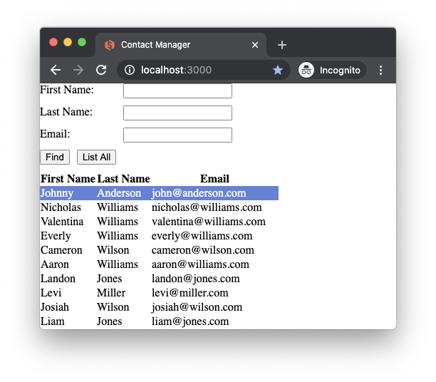

### External Samples

#### Glimmer Calculator

Add the [glimmer-cs-calculator](https://github.com/AndyObtiva/glimmer-cs-calculator) gem to `Gemfile` (without requiring):

```
gem 'glimmer-cs-calculator', require: false
```

Add the following require statement to `app/assets/javascripts/application.rb`

```ruby
require 'glimmer-cs-calculator/launch'
```

Glimmer app on the desktop (using the [`glimmer-dsl-swt`](https://github.com/AndyObtiva/glimmer-dsl-swt) gem):


Glimmer app on the web (using `glimmer-dsl-opal` gem):

Start the Rails server:
```
rails s
```

Visit `http://localhost:3000`
(or visit: http://glimmer-cs-calculator-server.herokuapp.com)

You should see "Glimmer Calculator"

[](http://glimmer-cs-calculator-server.herokuapp.com)

Here is an Apple Calculator CSS themed version (with [CSS only](https://github.com/AndyObtiva/glimmer-cs-calculator/blob/master/server/glimmer-cs-calculator-server/app/assets/stylesheets/welcomes_apple.scss), no app code changes):

Visit http://glimmer-cs-calculator-server.herokuapp.com/welcomes/apple

You should see "Apple Calculator Theme"

[](http://glimmer-cs-calculator-server.herokuapp.com/welcomes/apple)

## Help

### Issues

You may submit [issues](https://github.com/AndyObtiva/glimmer/issues) on [GitHub](https://github.com/AndyObtiva/glimmer/issues).

[Click here to submit an issue.](https://github.com/AndyObtiva/glimmer/issues)

### Chat

If you need live help, try to [](https://gitter.im/AndyObtiva/glimmer?utm_source=badge&utm_medium=badge&utm_campaign=pr-badge&utm_content=badge)

## Feature Suggestions

These features have been suggested. You might see them in a future version of Glimmer. You are welcome to contribute more feature suggestions.

[TODO.md](TODO.md)

## Change Log

[CHANGELOG.md](CHANGELOG.md)

## Contributing

[CONTRIBUTING.md](CONTRIBUTING.md)

## Contributors

* [Andy Maleh](https://github.com/AndyObtiva) (Founder)

[Click here to view contributor commits.](https://github.com/AndyObtiva/glimmer-dsl-opal/graphs/contributors)

## License

[MIT](https://opensource.org/licenses/MIT)

Copyright (c) 2020 - Andy Maleh.
See [LICENSE.txt](LICENSE.txt) for further details.

--

[](https://github.com/AndyObtiva/glimmer) Built for [Glimmer](https://github.com/AndyObtiva/glimmer) (Ruby Desktop Development GUI Library).
